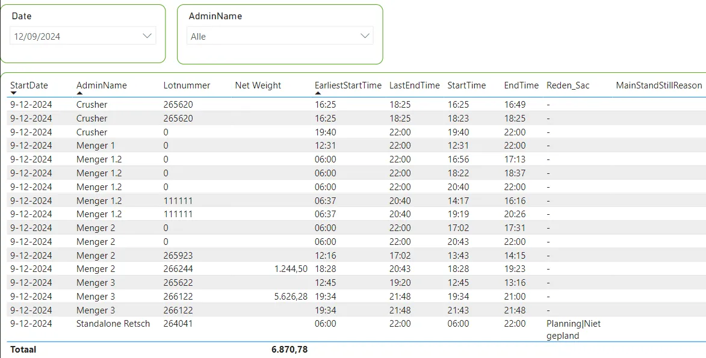
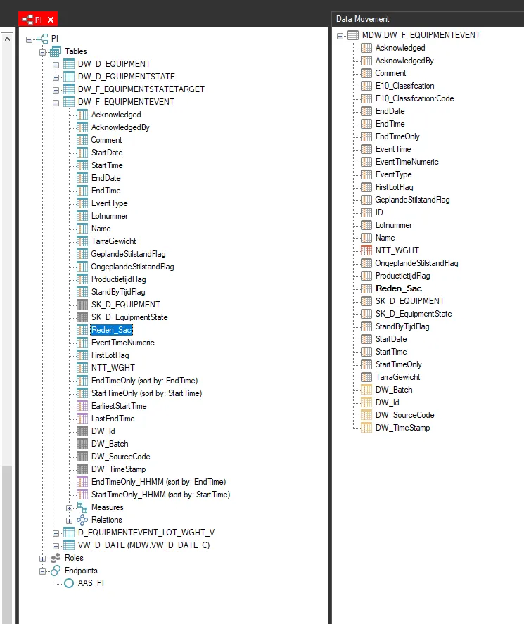
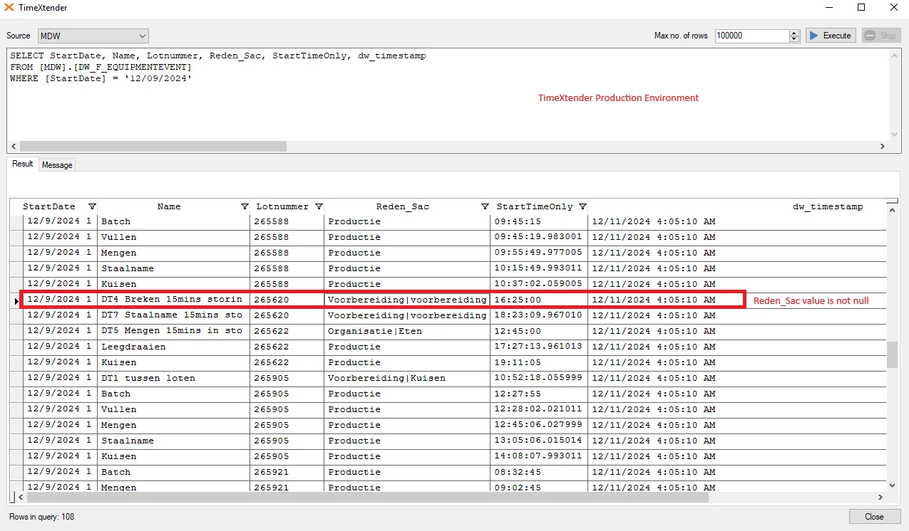
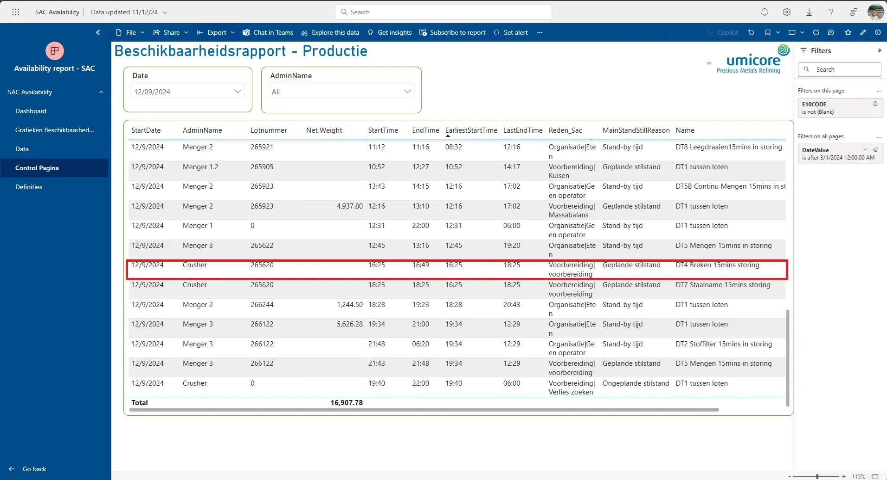

# 11122024 SAC Availability Report - Missing Reden_Sac (Reason)

## Incident Mail Thread

```
Dear colleagues,

Following comments about the Power BI report I am working with:

Lots on mixer 1.2 do not always get through (often lot 0)
Calling on the coaches to be sure to fill in the lottery number correctly
The name of installation mixer 1 does not appear in power BI, which means that this data is less well drawn (wrong order, etc.)
The crusher: does not run via the main sequence for the time being, so we still need this data on a manual document
Always report the reason for the standstill (even in the case of complete standstills to distinguish between unplanned/technical or no personnel)
Weights are not coming in
I thought JL was going to force this until the problem is resolved, but it doesn't happen???

Hopefully the very last steps are not the heaviest 😊.
Hopefully we will soon receive the redeeming news that we can abolish paper.

Greetings,
---
Hello Annelies,

JL has now resolved the cause of the missing weights so we expected it to be fine. Can you indicate where you expect to see weights? Then we can check. 

It is not that easy here to figure out which lines should or should not have a weight because many lines rightly do not have a weight.

For Menger 1. This has been resolved. It was in a misplaced bracket in the Sharepoint page itself, which meant that the lines of Menger 1 were not recognized. I have adjusted it myself in the Sharepoint so that you will see the data tomorrow morning.
---
Hello Isabelle,

Menger 1 is now visible and is correctly included in the Power BI report.
Crusher is now also included, so progress here too.

Weights visible, I will now compare and examine the lines carefully.

But ☹…
Today a whole list in power Bi with downtimes without reason and in PI VIsion everything has been entered, there are no downtimes from 9/12/2024 without reason.
Watched this both this morning and just now.
```

## Current Hypothesis

On d+1, data is erroneous, then corrects itself on d+2. 

Data on Reden_Sac arrives late.

Loading occurs at 0500h daily

## Investigation Proper

### Data from Annelies as of 10122024 1359



We can see that there is no "Reden_Sac" (Reason_SAC)

### Checking data in TimeXtender Production Environment & PBI Report as of 11122024

#### TimeXtender

The Reden_Sac field can be found in the PI Project Perspective, under the DW_F_EQUIPMENTEVENT Semantic Table, sourced from the MDW table of the same name



With the following query, able to see that the data is available in TX as of 11122024 

```sql
SELECT StartDate, Name, Lotnummer, Reden_Sac, StartTimeOnly, dw_timestamp
FROM [MDW].[DW_F_EQUIPMENTEVENT] 
WHERE [StartDate] = '12/09/2024'
```

**(Highlighted a specific record in Annelies' report that did not have a Reden_Sac value)**



#### PowerBI

We find it to be the same case in the PowerBI Report



#### Current actions

- Reached out to Gert if there is any way to check the input time of the Reden_Sac rows
  - "No there is no way in knowing when reason is filled in or changed" - Gert
- Add an extra load noon-time and check if reasons are filled in