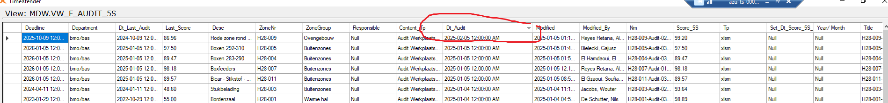

# Safety investigation

- Date (MDW.VW_D_DATE)
  - seems ok
- Functie Observator (MDW.VW_D_FUNCTIE_OBSERVATOR)
  - has data until dw_id = 77. the rest is all nulls but has dw_id until 99. looks like something is wrong with it
- BSC Targets (MDW.VW_D_PMS_TARGET_SAFETY)
  - has data but there are a lot of nulls. looks like something is wrong with it.
- Audit 5S (MDW.VW_F_AUDIT_5S)
  - looks like it has fact. there are no load dates though. plus there are some audit dates for dates that havent happened yet
  - 
- Follow Up Tasks Fact (MDW.VW_F_FOLLOW_UP_TASK)
  - Data seems to be loaded, has latest dw_timestamp
- Follow Up Tasks Monthly Snapshot (MDW.VW_F_FOLLOWUP_TASK_MONTHLY_SS)
  - Has data but last dw_timestamp was january 27, 2025
- Hazop (MDW.VW_F_HAZOP)
  - seems to have data, id = 1 is missing though
- Internal (MDW.VW_D_INTERNAL)
- Lifting Equipment Fact (MDW.VW_HWT_F_LIFTING_EQUIPMENT)
  - sk_d_department being messy
- MOC ITEM (MDW.VW_F_MOC_ITEM)
  - has data but the data quality is not good, especially for "requestor" column 
  - 
- Safety Incident Fact (MDW.VW_F_SAFETY)
  - has data and has unique keys. but keys can be fixed better 
  - 
- KRICOM (MDW.VW_F_TAG_ACTIONS)
  - has data but "notification number" which seems to be the transaction id has a lot of nulls
  - we have dw_id though
- WOB Facts (MDW.VW_F_WOB_SP)
  - completely empty but has dw_ids
  - 
- Safety Targets (MDW.VW_DW_D_SAFETY_TARGETS)
  - seems ok
- Safety Talks (MDW.VW_F_SAFETY_TALKS)
  - has data, low fact count (only 338)
- Safety TalksIndex (MDW.SafteyTalkIndex)
  - the mdw view is spelled wrong
  - what is this for? there are a lot of indexes. it just seems like its for correction / band aid solution?
  - 
- VorigePloegIndex (DSA.VorigePloegIndex_V)
  - the semantic layer is using a DSA view
  - seems like it was created to provide a way to sort the data, but it doesnt make sense
  - 
- Department (MDW.VW_D_DEPARTMENT)
  - department dim seems ok in itself but the facts that are using it follow these steps:
    - join on department name / department code upstream to fetch dw_id
    - convert dw_id into int (even though its already an int)
    - names the dw_id as sk_d_department
    - downstream, on the reports, joins on sk_d_department
  - problems:
    - dw_id is a platform dependent id, typically used for when something is loaded, not a "business key" that is used for dimensional joins
      - besides the facts related to safety, almost all other facts follow this logic
      - *appears to work now* because we are actually using the department names / department codes as join conditions earlier upstream
    - safety still uses "old department" as there are departments here that no longer appear in the newer version
      - extra filter condition on the report level. where the source department source should be "SP_UPMR" instead of scd_is_current = 1

Random things found:

what is this?

