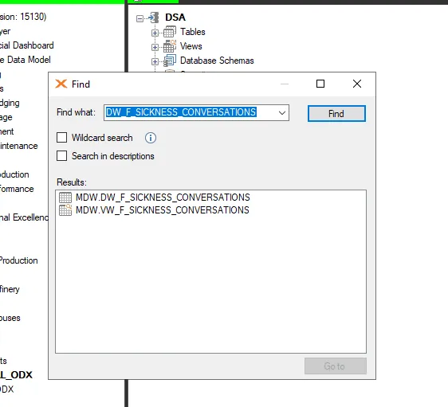
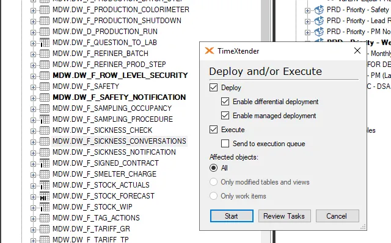
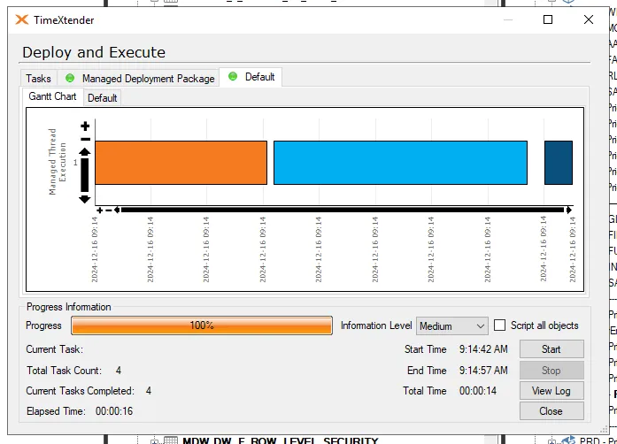
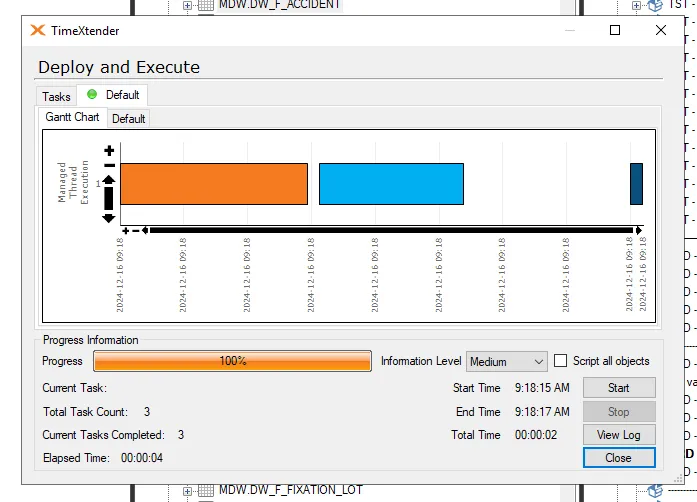
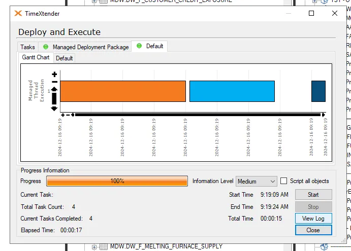
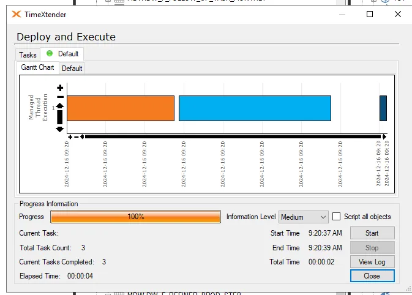
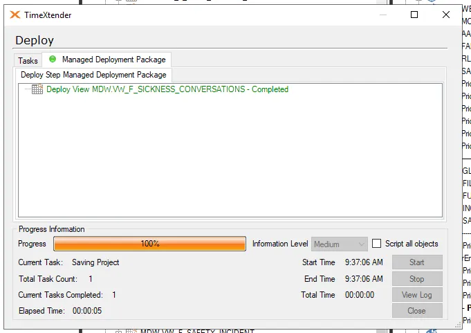
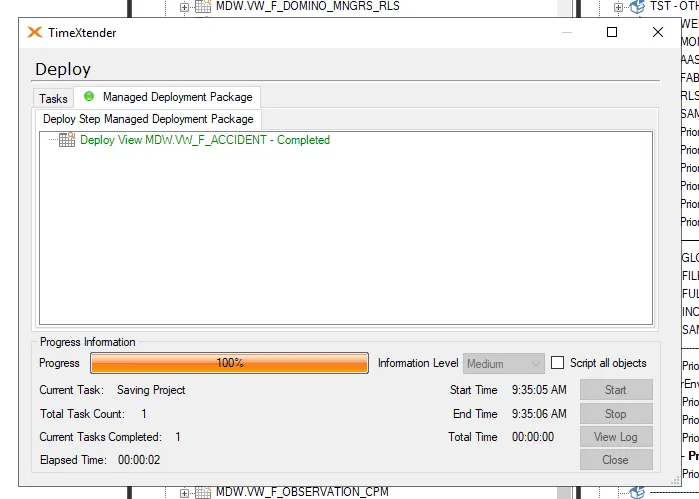
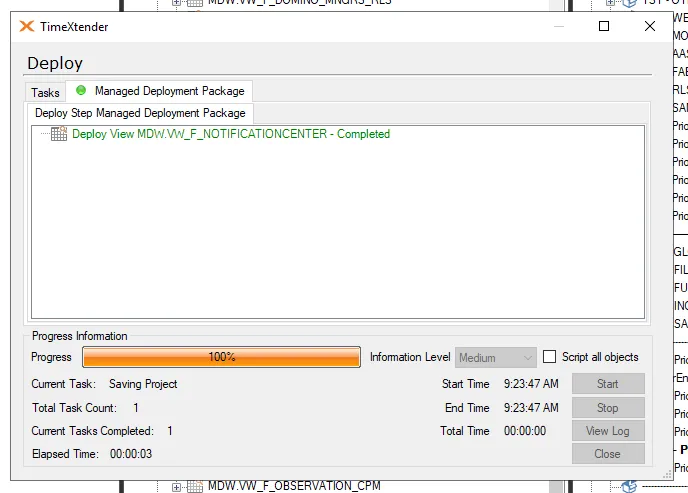
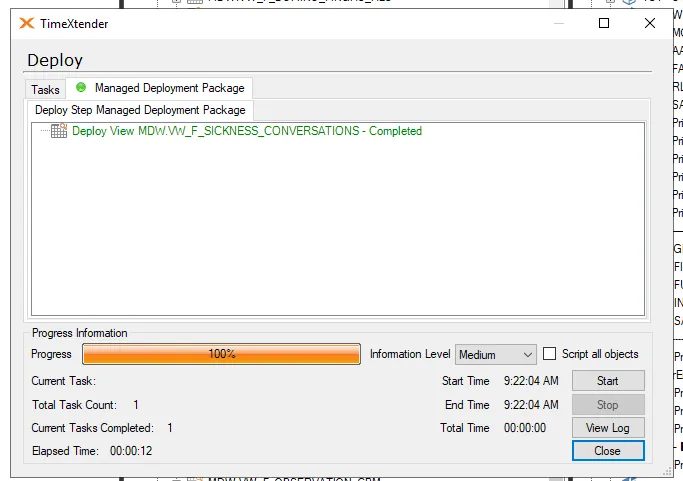

# TST INCR LOAD Investigation 16122024

## Error Message

- Coming from TX notification mail
```
Finished executing project 'PMR_DWH' Execution Package 'TST - INCR LOAD'
Execution failed
Start Time : 12/16/2024 3:23:06 AM End Time : 12/16/2024 6:27:42 AM on server: azu-ts-0002
-Execute Execution Package TST - INCR LOAD 'Failed'
        Error during Data Processing for Table: MDW.DW_F_SICKNESS_CONVERSATIONS at: MDW
        Invalid column name 'Department_SP'.
        Invalid column name 'SCD Is Current'.
       
        Stored Procedure: [MDW_ETL].[usp_DW_F_SICKNESS_CONVERSATIONS_Clean]
        Parameters:
        @version = 165929
       
        Line number: 95
       
        Details:
       
        SQL Server: 'azu-dataanalyticspmr-sql-tst.database.windows.net'
        SQL Procedure: 'MDW_ETL.usp_DW_F_SICKNESS_CONVERSATIONS_Clean'
        SQL Line Number: 95
        SQL Error Number: 207
       
        Invalid column name 'Department_SP'. ...
        Module: .Net SqlClient Data Provider
        System.Data.SqlClient.SqlException
           at System.Data.SqlClient.SqlConnection.OnError(SqlException exception, Boolean breakConnection, Action`1 wrapCloseInAction)
           at System.Data.SqlClient.TdsParser.ThrowExceptionAndWarning(TdsParserStateObject stateObj, Boolean callerHasConnectionLock, Boolean asyncClose)
           at System.Data.SqlClient.TdsParser.TryRun(RunBehavior runBehavior, SqlCommand cmdHandler, SqlDataReader dataStream, BulkCopySimpleResultSet bulkCopyHandler, TdsParserStateObject stateObj, Boolean& dataReady)
           at System.Data.SqlClient.SqlCommand.FinishExecuteReader(SqlDataReader ds, RunBehavior runBehavior, String resetOptionsString, Boolean isInternal, Boolean forDescribeParameterEncryption, Boolean shouldCacheForAlwaysEncrypted)
           at System.Data.SqlClient.SqlCommand.RunExecuteReaderTds(CommandBehavior cmdBehavior, RunBehavior runBehavior, Boolean returnStream, Boolean async, Int32 timeout, Task& task, Boolean asyncWrite, Boolean inRetry, SqlDataReader ds, Boolean describeParameterEncryptionRequest)
           at System.Data.SqlClient.SqlCommand.RunExecuteReader(CommandBehavior cmdBehavior, RunBehavior runBehavior, Boolean returnStream, String method, TaskCompletionSource`1 completion, Int32 timeout, Task& task, Boolean& usedCache, Boolean asyncWrite, Boolean inRetry)
           at System.Data.SqlClient.SqlCommand.InternalExecuteNonQuery(TaskCompletionSource`1 completion, String methodName, Boolean sendToPipe, Int32 timeout, Boolean& usedCache, Boolean asyncWrite, Boolean inRetry)
           at System.Data.SqlClient.SqlCommand.ExecuteNonQuery()
           at TimeXtender.DataManager.StepDataCleansingExecute.DoAbstractStep(StepSetup stepSetup)
       
        Error during Data Processing for Table: MDW.DW_F_SICKNESS_CONVERSATIONS at: MDW ...
        System.Exception
       
Execute Business Unit GLOBAL_ODX:Info:Initialized
Execute DSA:Info:Initialized
Execute MDW:Info:Initialized
  -Execute MDW
Execute Table MDW MDW.DW_D_ASSAY_STATUS:Info:Initialized
Execute Table MDW MDW.DW_D_BASEL_CD:Info:Initialized
Execute Table MDW MDW.DW_D_BLOCKING:Info:Initialized
Execute Table MDW MDW.DW_D_COACH:Info:Initialized
Execute Table MDW MDW.DW_D_COLLATERAL:Info:Initialized
Execute Table MDW MDW.DW_D_COMMERCIAL_INDEX:Info:Initialized
Execute Table MDW MDW.DW_D_COMPONENT:Info:Initialized
Execute Table MDW MDW.DW_D_CONTACT_PERSON:Info:Initialized
Execute Table MDW MDW.DW_D_CONTRACT:Info:Initialized
Execute Table MDW MDW.DW_D_CONVERSION_GR:Info:Initialized
Execute Table MDW MDW.DW_D_CUSTOMER:Info:Initialized
Execute Table MDW MDW.DW_D_CUSTOMER_FILE:Info:Initialized
Execute Table MDW MDW.DW_D_CUSTOMS_CD:Info:Initialized
Execute Table MDW MDW.DW_D_DATE:Info:Initialized
Execute Table MDW MDW.DW_D_DAY_REPORT:Info:Initialized
Execute Table MDW MDW.DW_D_DEPARTMENT:Info:Initialized
Execute Table MDW MDW.DW_D_DEPARTMENT_old:Info:Initialized
Execute Table MDW MDW.D_DEPOSIT_COVERAGE_LEVELS:Info:Initialized
Execute Table MDW MDW.DW_D_DUST_BUTTON:Info:Initialized
Execute Table MDW MDW.DW_D_ELEMENT:Info:Initialized
Execute Table MDW MDW.DW_D_ELEMENT_ORDER:Info:Initialized
Execute Table MDW MDW.DW_D_EMPLOYEE:Info:Initialized
Execute Table MDW MDW.DW_D_EURAL_CD:Info:Initialized
Execute Table MDW MDW.DW_D_ENVIRONMENT_TARGETS:Info:Initialized
Execute Table MDW MDW.DW_D_GR_LOT:Info:Initialized
Execute Table MDW MDW.DW_D_GROUP_LIF:Info:Initialized
Execute Table MDW MDW.DW_D_HEDGING_COVERAGE_LEVEL:Info:Initialized
Execute Table MDW MDW.DW_F_INCIDENT_REPORT:Info:Initialized
Execute Table MDW MDW.DW_D_INTERNAL:Info:Initialized
Execute Table MDW MDW.DW_D_INVENTORY_CD:Info:Initialized
Execute Table MDW MDW.DW_D_INVTR_ORDER:Info:Initialized
Execute Table MDW MDW.DW_D_KPI_NAMES:Info:Initialized
Execute Table MDW MDW.DW_D_KS_RATE:Info:Initialized
Execute Table MDW MDW.DW_D_L_ASSAYSTATUS_ORDER:Info:Initialized
Execute Table MDW MDW.DW_D_L_BRFDESC:Info:Initialized
Execute Table MDW MDW.DW_D_L_HPDESC:Info:Initialized
Execute Table MDW MDW.DW_D_LOT:Info:Initialized
Execute Table MDW MDW.DW_D_LOT_CATEGORY:Info:Initialized
Execute Table MDW MDW.DW_D_MANAGERS_LG:Info:Initialized
Execute Table MDW MDW.DW_D_MATERIAL:Info:Initialized
Execute Table MDW MDW.DW_D_MODEL:Info:Initialized
Execute Table MDW MDW.DW_D_MODEL_M_UNIT:Info:Initialized
Execute Table MDW MDW.DW_D_MOVEMENT_REASON:Info:Initialized
Execute Table MDW MDW.DW_D_MOVEMENT_UNIT:Info:Initialized
Execute Table MDW MDW.DW_D_OFFER:Info:Initialized
Execute Table MDW MDW.DW_D_OPEXC_TARGETS:Info:Initialized
Execute Table MDW MDW.DW_D_PEOPLE_TARGETS:Info:Initialized
Execute Table MDW MDW.DW_D_PMS_TARGET_SAFETY:Info:Initialized
Execute Table MDW MDW.DW_D_POLARPLOT:Info:Initialized
Execute Table MDW MDW.DW_D_PRODUCT:Info:Initialized
Execute Table MDW MDW.DW_D_QUOTE:Info:Initialized
Execute Table MDW MDW.DW_D_REPORTING_PERIOD:Info:Initialized
Execute Table MDW MDW.DW_D_RLS_DEPARTMENT:Info:Initialized
Execute Table MDW MDW.DW_D_SAC_BATCH:Info:Initialized
Execute Table MDW MDW.DW_D_SAMPLE_STEP_LEAD_TIME:Info:Initialized
Execute Table MDW MDW.DW_D_SAMPLING_STEP:Info:Initialized
Execute Table MDW MDW.DW_D_SAMPLING_TEAM:Info:Initialized
Execute Table MDW MDW.DW_D_SENSOR:Info:Initialized
Execute Table MDW MDW.DW_D_SIMULATION:Info:Initialized
Execute Table MDW MDW.DW_D_TIME:Info:Initialized
Execute Table MDW MDW.DW_D_UNIT_OF_MEASURE:Info:Initialized
Execute Table MDW MDW.DW_D_XRF_ANALYSIS:Info:Initialized
Execute Table MDW MDW.DW_D_XRF_SITE:Info:Initialized
Execute Table MDW MDW.DW_F_5S:Info:Initialized
Execute Table MDW MDW.DW_F_ACCIDENT:Info:Initialized
    -Execute Table MDW MDW.DW_F_ACCIDENT
Execute MDW MDW.DW_F_ACCIDENT Direct Read Transfer:Info:Successful
Execute MDW MDW.DW_F_ACCIDENT Data Cleansing Rules:Error:Failed
      -Execute MDW MDW.DW_F_ACCIDENT Data Cleansing Rules 'Failed'
         Error during Data Processing for Table: MDW.DW_F_ACCIDENT at: MDW
         Invalid column name 'Department_SP'.
        
         Stored Procedure: [MDW_ETL].[usp_DW_F_ACCIDENT_Clean]
         Parameters:
         @version = 165929
        
         Line number: 82
        
         Details:
        
         SQL Server: 'azu-dataanalyticspmr-sql-tst.database.windows.net'
         SQL Procedure: 'MDW_ETL.usp_DW_F_ACCIDENT_Clean'
         SQL Line Number: 82
         SQL Error Number: 207
        
         Invalid column name 'Department_SP'.
         Module: .Net SqlClient Data Provider
         System.Data.SqlClient.SqlException
            at System.Data.SqlClient.SqlConnection.OnError(SqlException exception, Boolean breakConnection, Action`1 wrapCloseInAction)
            at System.Data.SqlClient.TdsParser.ThrowExceptionAndWarning(TdsParserStateObject stateObj, Boolean callerHasConnectionLock, Boolean asyncClose)
            at System.Data.SqlClient.TdsParser.TryRun(RunBehavior runBehavior, SqlCommand cmdHandler, SqlDataReader dataStream, BulkCopySimpleResultSet bulkCopyHandler, TdsParserStateObject stateObj, Boolean& dataReady)
            at System.Data.SqlClient.SqlCommand.FinishExecuteReader(SqlDataReader ds, RunBehavior runBehavior, String resetOptionsString, Boolean isInternal, Boolean forDescribeParameterEncryption, Boolean shouldCacheForAlwaysEncrypted)
            at System.Data.SqlClient.SqlCommand.RunExecuteReaderTds(CommandBehavior cmdBehavior, RunBehavior runBehavior, Boolean returnStream, Boolean async, Int32 timeout, Task& task, Boolean asyncWrite, Boolean inRetry, SqlDataReader ds, Boolean describeParameterEncryptionRequest)
            at System.Data.SqlClient.SqlCommand.RunExecuteReader(CommandBehavior cmdBehavior, RunBehavior runBehavior, Boolean returnStream, String method, TaskCompletionSource`1 completion, Int32 timeout, Task& task, Boolean& usedCache, Boolean asyncWrite, Boolean inRetry)
            at System.Data.SqlClient.SqlCommand.InternalExecuteNonQuery(TaskCompletionSource`1 completion, String methodName, Boolean sendToPipe, Int32 timeout, Boolean& usedCache, Boolean asyncWrite, Boolean inRetry)
            at System.Data.SqlClient.SqlCommand.ExecuteNonQuery()
            at TimeXtender.DataManager.StepDataCleansingExecute.DoAbstractStep(StepSetup stepSetup)
        
         Error during Data Processing for Table: MDW.DW_F_ACCIDENT at: MDW ...
         System.Exception
        

No child steps
Execute Table MDW MDW.DW_F_ARRIVALS_FORECAST:Info:Initialized
Execute Table MDW MDW.DW_F_ARRIVALS_VWGS:Info:Initialized
Execute Table MDW MDW.DW_F_AUDIT_5S:Info:Initialized
Execute Table MDW MDW.DW_F_BEGINSTOCK:Info:Initialized
Execute Table MDW MDW.DW_F_BPS:Info:Initialized
Execute Table MDW MDW.DW_F_BW_DEVICES:Info:Initialized
Execute Table MDW MDW.DW_F_BW_INTERVENTIONS:Info:Initialized
Execute Table MDW MDW.DW_F_BW_MEASURES:Info:Initialized
Execute Table MDW MDW. DW_F_CBE:Info:Initialized
Execute Table MDW MDW.DW_F_CONTRACT_TERM:Info:Initialized
Execute Table MDW MDW.DW_F_CUST_COMPLAINT:Info:Initialized
Execute Table MDW MDW.DW_F_CUSTOMER_CREDIT_EXPOSURE:Info:Initialized
Execute Table MDW MDW.DW_F_CUSTOMER_CREDIT_LINE:Info:Initialized
Execute Table MDW MDW.DW_F_CUST_SERVICE_REPORT:Info:Initialized
Execute Table MDW MDW.DW_F_DPRTMNT_RLS:Info:Initialized
Execute Table MDW MDW.DW_F_DUST_BUTTON_BOX:Info:Initialized
Execute Table MDW MDW.DW_F_EMISSIONS_ANOMALY_HOURLY:Info:Initialized
Execute Table MDW MDW.DW_F_EMISSIONS_DAILY_CONCENTRATION:Info:Initialized
Execute Table MDW MDW.DW_F_EMISSIONS_DEWEATHERED:Info:Initialized
Execute Table MDW MDW.DW_F_EMISSIONS_XRF_CLUSTERING:Info:Initialized
Execute Table MDW MDW.DW_F_EMISSIONS_XRF_CONCENTRATION:Info:Initialized
Execute Table MDW MDW.DW_F_EMISSIONS_XRF_CORRELATION:Info:Initialized
Execute Table MDW MDW.DW_F_EMISSIONS_XRF_DEWEATHERED:Info:Initialized
Execute Table MDW MDW.DW_F_EMISSIONS_XRF_WEATHER_PROCESS:Info:Initialized
Execute Table MDW MDW.DW_F_EMR_OCCUPANCY_RATE:Info:Initialized
Execute Table MDW MDW.DW_F_EMR_PRODUCTION_EVENT:Info:Initialized
Execute Table MDW MDW.DW_F_FIXATION_LOT:Info:Initialized
Execute Table MDW MDW.DW_F_FOLLOWUP_TASK:Info:Initialized
Execute Table MDW MDW.DW_F_FOLLOW_UP_TASK_MONTHLY:Info:Initialized
Execute Table MDW MDW.DW_F_GOAT:Info:Initialized
Execute Table MDW MDW.DW_F_HAZOP:Info:Initialized
Execute Table MDW MDW.DW_F_H_WeeklyKPISnapshot:Info:Initialized
Execute Table MDW MDW.DW_F_INCIDENT:Info:Initialized
Execute Table MDW MDW.DW_F_LOT_ANALYSIS_ELEMENT:Info:Initialized
Execute Table MDW MDW.DW_F_LOT_ELEMENT_STATUS:Info:Initialized
Execute Table MDW MDW.DW_F_MASS_BALANCE:Info:Initialized
Execute Table MDW MDW.DW_F_MELTING_FURNACE_BATCH:Info:Initialized
Execute Table MDW MDW.DW_F_MELTING_FURNACE_BED:Info:Initialized
Execute Table MDW MDW.DW_F_MELTING_FURNACE_SUPPLY:Info:Initialized
Execute Table MDW MDW.DW_F_MOC_ITEM:Info:Initialized
Execute Table MDW MDW.DW_F_MOVEMENT_SHIP:Info:Initialized
Execute Table MDW MDW.DW_F_NON_CONFORMITY:Info:Initialized
Execute Table MDW MDW.DW_F_NOTIFICATIONCENTER:Info:Initialized
    -Execute Table MDW MDW.DW_F_NOTIFICATIONCENTER
Execute MDW MDW.DW_F_NOTIFICATIONCENTER Direct Read Transfer:Info:Successful
Execute MDW MDW.DW_F_NOTIFICATIONCENTER Data Cleansing Rules:Error:Failed
      -Execute MDW MDW.DW_F_NOTIFICATIONCENTER Data Cleansing Rules 'Failed'
         Error during Data Processing for Table: MDW.DW_F_NOTIFICATIONCENTER at: MDW
         Invalid column name 'Department_SP'.
        
         Stored Procedure: [MDW_ETL].[usp_DW_F_NOTIFICATIONCENTER_Clean]
         Parameters:
         @version = 165929
        
         Line number: 68
        
         Details:
        
         SQL Server: 'azu-dataanalyticspmr-sql-tst.database.windows.net'
         SQL Procedure: 'MDW_ETL.usp_DW_F_NOTIFICATIONCENTER_Clean'
         SQL Line Number: 68
         SQL Error Number: 207
        
         Invalid column name 'Department_SP'.
         Module: .Net SqlClient Data Provider
         System.Data.SqlClient.SqlException
            at System.Data.SqlClient.SqlConnection.OnError(SqlException exception, Boolean breakConnection, Action`1 wrapCloseInAction)
            at System.Data.SqlClient.TdsParser.ThrowExceptionAndWarning(TdsParserStateObject stateObj, Boolean callerHasConnectionLock, Boolean asyncClose)
            at System.Data.SqlClient.TdsParser.TryRun(RunBehavior runBehavior, SqlCommand cmdHandler, SqlDataReader dataStream, BulkCopySimpleResultSet bulkCopyHandler, TdsParserStateObject stateObj, Boolean& dataReady)
            at System.Data.SqlClient.SqlCommand.FinishExecuteReader(SqlDataReader ds, RunBehavior runBehavior, String resetOptionsString, Boolean isInternal, Boolean forDescribeParameterEncryption, Boolean shouldCacheForAlwaysEncrypted)
            at System.Data.SqlClient.SqlCommand.RunExecuteReaderTds(CommandBehavior cmdBehavior, RunBehavior runBehavior, Boolean returnStream, Boolean async, Int32 timeout, Task& task, Boolean asyncWrite, Boolean inRetry, SqlDataReader ds, Boolean describeParameterEncryptionRequest)
            at System.Data.SqlClient.SqlCommand.RunExecuteReader(CommandBehavior cmdBehavior, RunBehavior runBehavior, Boolean returnStream, String method, TaskCompletionSource`1 completion, Int32 timeout, Task& task, Boolean& usedCache, Boolean asyncWrite, Boolean inRetry)
            at System.Data.SqlClient.SqlCommand.InternalExecuteNonQuery(TaskCompletionSource`1 completion, String methodName, Boolean sendToPipe, Int32 timeout, Boolean& usedCache, Boolean asyncWrite, Boolean inRetry)
            at System.Data.SqlClient.SqlCommand.ExecuteNonQuery()
            at TimeXtender.DataManager.StepDataCleansingExecute.DoAbstractStep(StepSetup stepSetup)
        
         Error during Data Processing for Table: MDW.DW_F_NOTIFICATIONCENTER at: MDW ...
         System.Exception
        

No child steps
Execute Table MDW MDW.DW_F_OBSERVATION_CPM:Info:Initialized
Execute Table MDW MDW.DW_F_PBM_LENDING:Info:Initialized
Execute Table MDW MDW.DW_F_PBM_USAGE:Info:Initialized
Execute Table MDW MDW.DW_F_PRODUCTION_ANALYSIS:Info:Initialized
Execute Table MDW MDW.DW_F_PRODUCTION_ANALYSIS_ELEMENT:Info:Initialized
Execute Table MDW MDW.DW_F_PRODUCTION_BATCH:Info:Initialized
Execute Table MDW MDW.DW_F_PRODUCTION_BATCH_STEP:Info:Initialized
Execute Table MDW MDW.DW_F_PRODUCTION_COLORIMETER:Info:Initialized
Execute Table MDW MDW.DW_F_PRODUCTION_SHUTDOWN:Info:Initialized
Execute Table MDW MDW.DW_D_PRODUCTION_RUN:Info:Initialized
Execute Table MDW MDW.DW_F_QUESTION_TO_LAB:Info:Initialized
Execute Table MDW MDW.DW_F_REFINER_BATCH:Info:Initialized
Execute Table MDW MDW.DW_F_REFINER_PROD_STEP:Info:Initialized
Execute Table MDW MDW.DW_F_ROW_LEVEL_SECURITY:Info:Initialized
Execute Table MDW MDW.DW_F_SAFETY:Info:Initialized
Execute Table MDW MDW.DW_F_SAFETY_NOTIFICATION:Info:Initialized
Execute Table MDW MDW.DW_F_SAMPLING_OCCUPANCY:Info:Initialized
Execute Table MDW MDW.DW_F_SAMPLING_PROCEDURE:Info:Initialized
Execute Table MDW MDW.DW_F_SICKNESS_CHECK:Info:Initialized
Execute Table MDW MDW.DW_F_SICKNESS_CONVERSATIONS:Info:Initialized
    -Execute Table MDW MDW.DW_F_SICKNESS_CONVERSATIONS
Execute MDW MDW.DW_F_SICKNESS_CONVERSATIONS Direct Read Transfer:Info:Successful
Execute MDW MDW.DW_F_SICKNESS_CONVERSATIONS Data Cleansing Rules:Error:Failed
      -Execute MDW MDW.DW_F_SICKNESS_CONVERSATIONS Data Cleansing Rules 'Failed'
         Error during Data Processing for Table: MDW.DW_F_SICKNESS_CONVERSATIONS at: MDW
         Invalid column name 'Department_SP'.
         Invalid column name 'SCD Is Current'.
        
         Stored Procedure: [MDW_ETL].[usp_DW_F_SICKNESS_CONVERSATIONS_Clean]
         Parameters:
         @version = 165929
        
         Line number: 95
        
         Details:
        
         SQL Server: 'azu-dataanalyticspmr-sql-tst.database.windows.net'
         SQL Procedure: 'MDW_ETL.usp_DW_F_SICKNESS_CONVERSATIONS_Clean'
         SQL Line Number: 95
         SQL Error Number: 207
        
         Invalid column name 'Department_SP'. ...
         Module: .Net SqlClient Data Provider
         System.Data.SqlClient.SqlException
            at System.Data.SqlClient.SqlConnection.OnError(SqlException exception, Boolean breakConnection, Action`1 wrapCloseInAction)
            at System.Data.SqlClient.TdsParser.ThrowExceptionAndWarning(TdsParserStateObject stateObj, Boolean callerHasConnectionLock, Boolean asyncClose)
            at System.Data.SqlClient.TdsParser.TryRun(RunBehavior runBehavior, SqlCommand cmdHandler, SqlDataReader dataStream, BulkCopySimpleResultSet bulkCopyHandler, TdsParserStateObject stateObj, Boolean& dataReady)
            at System.Data.SqlClient.SqlCommand.FinishExecuteReader(SqlDataReader ds, RunBehavior runBehavior, String resetOptionsString, Boolean isInternal, Boolean forDescribeParameterEncryption, Boolean shouldCacheForAlwaysEncrypted)
            at System.Data.SqlClient.SqlCommand.RunExecuteReaderTds(CommandBehavior cmdBehavior, RunBehavior runBehavior, Boolean returnStream, Boolean async, Int32 timeout, Task& task, Boolean asyncWrite, Boolean inRetry, SqlDataReader ds, Boolean describeParameterEncryptionRequest)
            at System.Data.SqlClient.SqlCommand.RunExecuteReader(CommandBehavior cmdBehavior, RunBehavior runBehavior, Boolean returnStream, String method, TaskCompletionSource`1 completion, Int32 timeout, Task& task, Boolean& usedCache, Boolean asyncWrite, Boolean inRetry)
            at System.Data.SqlClient.SqlCommand.InternalExecuteNonQuery(TaskCompletionSource`1 completion, String methodName, Boolean sendToPipe, Int32 timeout, Boolean& usedCache, Boolean asyncWrite, Boolean inRetry)
            at System.Data.SqlClient.SqlCommand.ExecuteNonQuery()
            at TimeXtender.DataManager.StepDataCleansingExecute.DoAbstractStep(StepSetup stepSetup)
        
         Error during Data Processing for Table: MDW.DW_F_SICKNESS_CONVERSATIONS at: MDW ...
         System.Exception
        

No child steps
Execute Table MDW MDW.DW_F_SICKNESS_NOTIFICATION:Info:Initialized
Execute Table MDW MDW.DW_F_SIGNED_CONTRACT:Info:Initialized
Execute Table MDW MDW.DW_F_SMELTER_CHARGE:Info:Initialized
Execute Table MDW MDW.DW_F_STOCK_ACTUALS:Info:Initialized
Execute Table MDW MDW.DW_F_STOCK_FORECAST:Info:Initialized
Execute Table MDW MDW.DW_F_STOCK_WIP:Info:Initialized
Execute Table MDW MDW.DW_F_TAG_ACTIONS:Info:Initialized
Execute Table MDW MDW.DW_F_TARIFF_GR:Info:Initialized
Execute Table MDW MDW.DW_F_TARIFF_TP:Info:Initialized
Execute Table MDW MDW.DW_F_TASK_MENGER:Info:Initialized
Execute Table MDW MDW.DW_F_UNIT_OF_MEASURE:Info:Initialized
Execute Table MDW MDW.DW_F_TASK_STEP_MENGER:Info:Initialized
Execute Table MDW MDW.DW_F_VISIT_REPORT:Info:Initialized
Execute Table MDW MDW.DW_F_WeeklyKPISnapshot:Info:Initialized
Execute Table MDW MDW.DW_F_WOB_SP:Info:Initialized
Execute Table MDW MDW.DW_F_ZMC_LOT_ANALYSIS:Info:Initialized
Execute Table MDW MDW.DW_F_HWT_LIFTING_EQUIPMENT:Info:Initialized
Execute Table MDW MDW_ETL.SYS_DUMMY_EXCEPTIONS:Info:Initialized
Execute Table MDW MDW_PMR.D_ACTIVITY_TYPES:Info:Initialized
Execute Table MDW MDW_PMR.D_BUSINESS_UNITS:Info:Initialized
Execute Table MDW MDW_PMR.D_CALENDAR:Info:Initialized
Execute Table MDW MDW_PMR.D_COMPANIES:Info:Initialized
Execute Table MDW MDW_PMR.D_EQUIPMENTS:Info:Initialized
Execute Table MDW MDW_PMR.D_FUNCTION_LOCATIONS:Info:Initialized
Execute Table MDW MDW_PMR.D_MANAGERS:Info:Initialized
Execute Table MDW MDW_PMR.D_PLANNING_GROUPS:Info:Initialized
Execute Table MDW MDW_PMR.D_USERS:Info:Initialized
Execute Table MDW MDW_PMR.D_WORKCENTERS:Info:Initialized
Execute Table MDW MDW_PMR.F_FACT:Info:Initialized
Execute Table MDW MDW.F_MonthlyKPISnapshot:Info:Initialized
Execute Table MDW MDW.F_H_MonthlyKPISnapshot:Info:Initialized
Execute Table MDW MDW.DW_D_FUNCTIE_OBSERVATOR:Info:Initialized
Execute Table MDW MDW.DW_D_EQUIPMENT:Info:Initialized
Execute Table MDW MDW.D_EQUIPMENTEVENTTYPE:Info:Initialized
Execute Table MDW MDW.DW_F_EQUIPMENTEVENT:Info:Initialized
Execute Table MDW MDW.DW_F_EQUIPMENTSTATETARGET:Info:Initialized
Execute Table MDW MDW.D_EQUIPMENTEVENT_LOT_WGHT_V:Info:Initialized
Execute Table MDW MDW.DW_D_EQUIPMENTSTATE:Info:Initialized
Execute Table MDW MDW.DW_D_LR_WEEK_KPI:Info:Initialized
Execute Table MDW MDW.DW_D_LR_NBR_OF_DAYS:Info:Initialized
Execute Table MDW MDW.F_SLKLT_ANALYSEBOOK:Info:Initialized
Execute Table MDW MDW.DW_D_LR_MAAND_KPI:Info:Initialized
Execute Table MDW MDW.DW_F_SLKLT_STOCK:Info:Initialized
Execute Table MDW MDW.DW_D_LR_DUURTIJD_POMPINGEN:Info:Initialized
Execute Table MDW MDW.DW_D_SAFETY_TARGETS:Info:Initialized
Execute Table MDW MDW.DW_F_SAFETY_TALKS:Info:Initialized
Execute Table MDW MDW.SafteyTalkIndex:Info:Initialized
Execute Table MDW MDW.DW_AG_EQUIPMENTEVET:Info:Initialized
Execute Table MDW MDW.VW_EXECPCKGLOGDETAILS:Info:Initialized
Execute Table MDW MDW.VW_EXECPCKGLOG:Info:Initialized
Execute Table MDW MDW.DW_F_CUSTOMER_COMPLAINTS:Info:Initialized
Execute Table MDW MDW.DW_F_KLANTEN_KLACHTEN:Info:Initialized
Execute Table MDW MDW.DW_F_NON_CONFORMITEITEN:Info:Initialized
Execute Table MDW MDW.DW_D_KPI_NAMESS:Info:Initialized
Execute Table MDW MDW.DW_F_Antwoorden:Info:Initialized
Execute Table MDW MDW.DW_D_Parent:Info:Initialized
Execute Table MDW MDW.DW_F_Taken:Info:Initialized
Execute Table MDW MDW.DW_D_Vragen:Info:Initialized
Execute Table MDW MDW.DW_D_Department_Hoboken:Info:Initialized
Execute Table MDW MDW.F_SAFETY_NOTIFICATION:Info:Initialized
Execute Table MDW MDW.F_SAFETY_TALKS:Info:Initialized
Execute Semantic Models:Info:Initialized
```

- Isolate only relevant messages errors

### Error 1
```
Error during Data Processing for Table: MDW.DW_F_SICKNESS_CONVERSATIONS at: MDW
Invalid column name 'Department_SP'.
Invalid column name 'SCD Is Current'.

Stored Procedure: [MDW_ETL].[usp_DW_F_SICKNESS_CONVERSATIONS_Clean]
Parameters:
@version = 165929

Line number: 95

Details:

SQL Server: 'azu-dataanalyticspmr-sql-tst.database.windows.net'
SQL Procedure: 'MDW_ETL.usp_DW_F_SICKNESS_CONVERSATIONS_Clean'
SQL Line Number: 95
SQL Error Number: 207
```

### Error 2
```
Error during Data Processing for Table: MDW.DW_F_ACCIDENT at: MDW
Invalid column name 'Department_SP'.

Stored Procedure: [MDW_ETL].[usp_DW_F_ACCIDENT_Clean]
Parameters:
@version = 165929

Line number: 82

Details:

SQL Server: 'azu-dataanalyticspmr-sql-tst.database.windows.net'
SQL Procedure: 'MDW_ETL.usp_DW_F_ACCIDENT_Clean'
SQL Line Number: 82
SQL Error Number: 207
```

### Error 3
```
Error during Data Processing for Table: MDW.DW_F_NOTIFICATIONCENTER at: MDW
Invalid column name 'Department_SP'.

Stored Procedure: [MDW_ETL].[usp_DW_F_NOTIFICATIONCENTER_Clean]
Parameters:
@version = 165929

Line number: 68

Details:

SQL Server: 'azu-dataanalyticspmr-sql-tst.database.windows.net'
SQL Procedure: 'MDW_ETL.usp_DW_F_NOTIFICATIONCENTER_Clean'
SQL Line Number: 68
SQL Error Number: 207
```

### Error 4
```
Error during Data Processing for Table: MDW.DW_F_SICKNESS_CONVERSATIONS at: MDW
Invalid column name 'Department_SP'.
Invalid column name 'SCD Is Current'.

Stored Procedure: [MDW_ETL].[usp_DW_F_SICKNESS_CONVERSATIONS_Clean]
Parameters:
@version = 165929

Line number: 95

Details:

SQL Server: 'azu-dataanalyticspmr-sql-tst.database.windows.net'
SQL Procedure: 'MDW_ETL.usp_DW_F_SICKNESS_CONVERSATIONS_Clean'
SQL Line Number: 95
SQL Error Number: 207
```

### General Findings on Errors

- All related to invalid column names, brought about by the update to department_dim
- All related to "_Clean"
  - Whenever we create objects in TX, TX will automatically generate an _Clean file that we can inspect (in TX or even easier in SSMS)
  - What it does is TX sets some "rules" for the code that it is related to
  - Example: ```DW_F_SICKNESS_CONVERSATIONS``` will have a corresponding ```DW_F_SICKNESS_CONVERSATIONS_Clean```
  - It is like the ```.yml``` files that we have in dbt
  - We basically need to *"refresh"* the *```.yml```* equivalent of TX (not actually ```.yml```, just an example)
- The tables indicated are expecting the *previous schema*
- We need to refresh them to expect the *new schema*
- First thing to try is to just re-deploy these specific objects to see if it is enough

## Fix Attempt #1: Redeploy
1. Search for relevant TX Object (DW_F_SICKNESS_CONVERSATIONS)
   
2. I recommend deploy and execute (to see if the code *compiles* and *runs*)
   
3. Success
   
4. Repeat for all remaining tables
   - Make sure that this really is the same case for all
   - DW_F_ACCIDENT (Success)
   - 
   - DW_F_NOTIFICATIONCENTER (Success)
   - 
   - DW_F_SICKNESS_CONVERSATIONS (Success)
   - 
5. To be *extra* sure, redeployed their equivalent custom views as well
   - 
   - 
   - 
   - 

## Check if TST - INCR LOAD now works