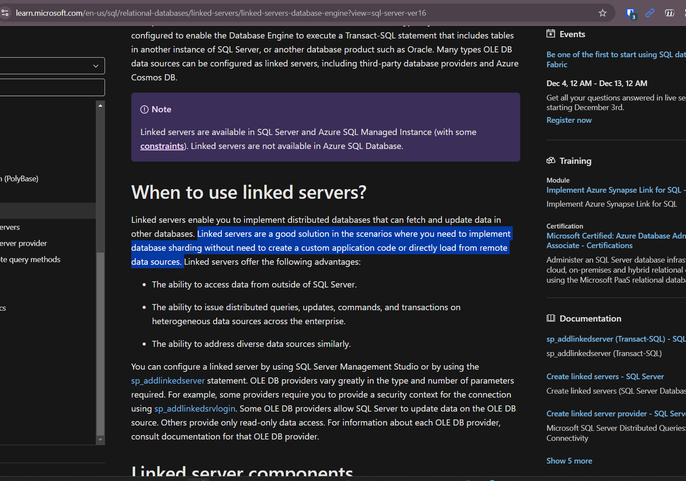

# PI Web API VS SQL Linked Servers
- Ine had mentioned that she would prefer the PI API way of working as she thinks the option to work with the linked server is not production-grade
  - Linked Server route: 
    - `+` No need for an application layer if we just do a database-to-database connection. 
    - `+` Leverage database user security instead of managing API endpoint credentials and tokens
    - `-` API mentioned as the future "way-of-working"
      - This is from a data-access POV though and not really for lifting a large amount of historical data from one db to another
    - `-` PI team was previously able to work with linked servers, but this workflow had been removed
      - Reason for removal might be an unforeseen challenge
  
## [Microsoft Documentation: Linked Servers](https://learn.microsoft.com/en-us/sql/relational-databases/linked-servers/linked-servers-database-engine?view=sql-server-ver16)

## Questions:
  - Any context we are blind to that has umicore enforcing PI Web API as the defacto way of communicating with PI?
  - Currently we are pulling from views created in PI SQL Commander Lite -> If we are to move to APIs for consistency, do we need to re-do?
  - Moving to an API way of working would enforce to be API devs over Data Engineers
    - Working with APIs VS working with Databases
- If we are to proceed with linked service, we need some backing to convince `Jeroen De Wolf` as well