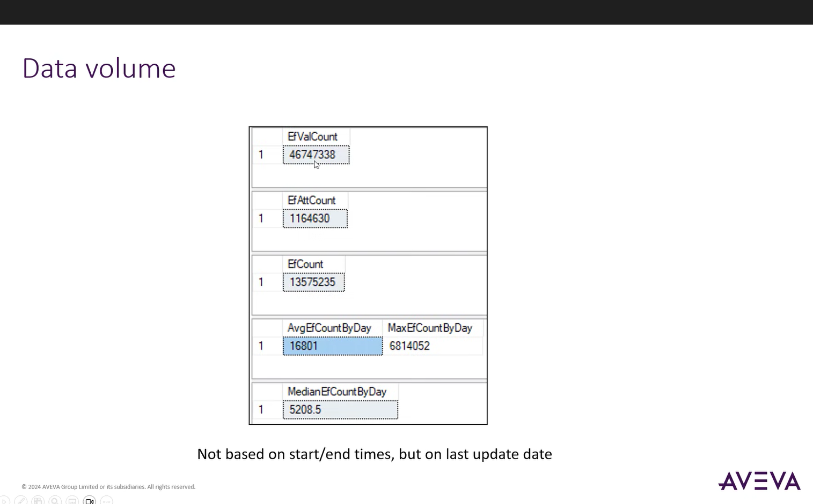
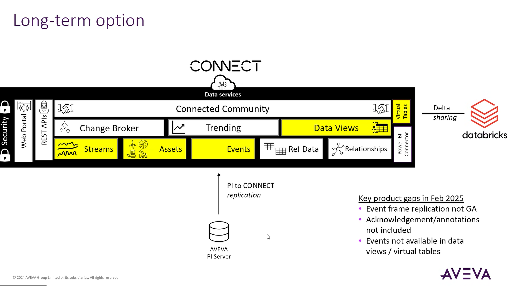
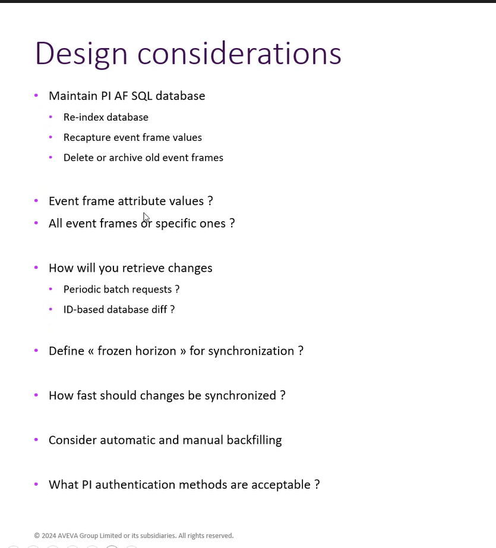
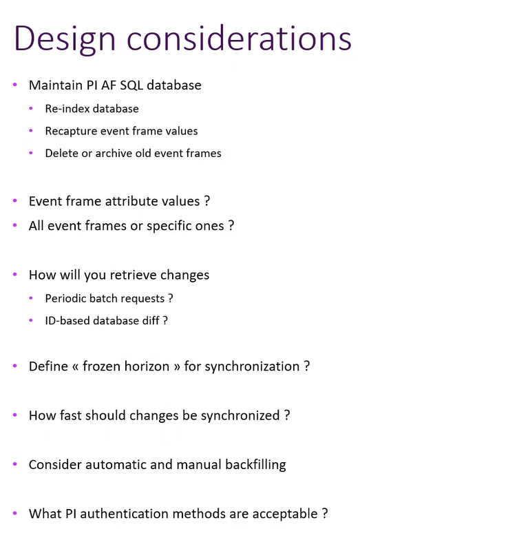
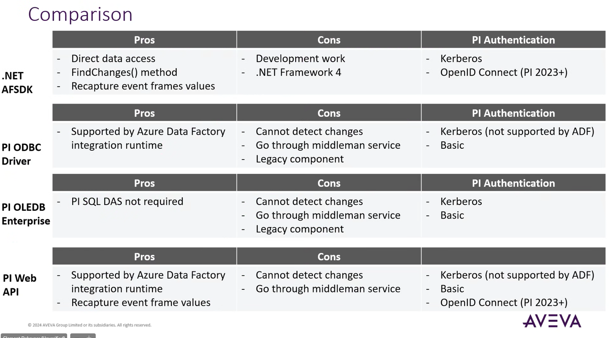
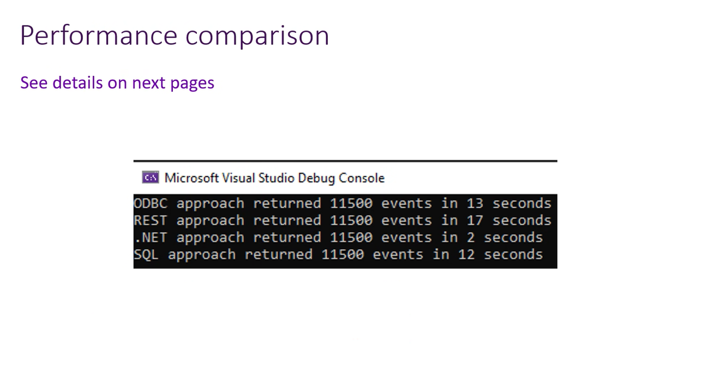
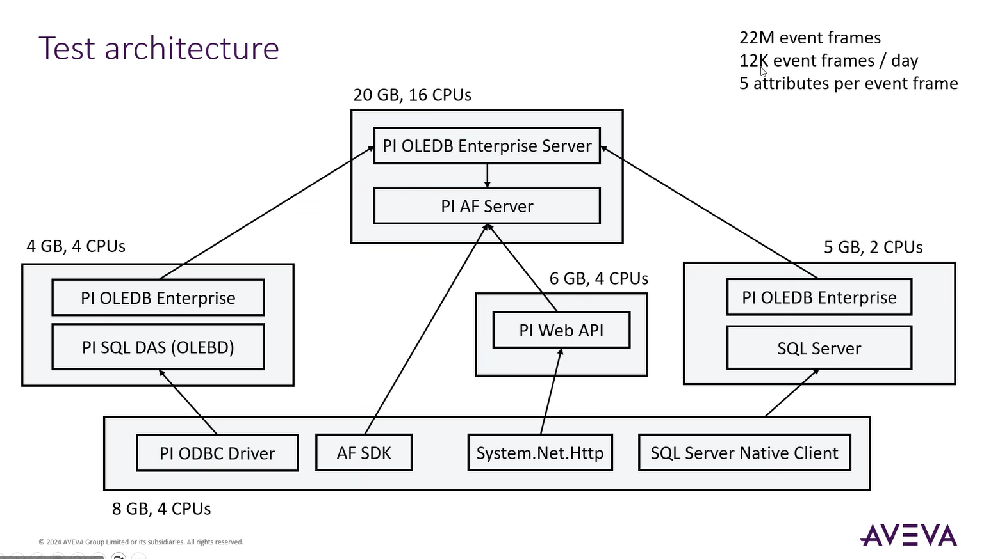

# February 18, 2025

## Agenda

Post implementation of PI EF Data Ingestiong via ADF, the Umicore team consults Aveva technical advisors. Perhaps they have a better opinion.

Key point: we want to centralize the data, to avoid everyone querying from PI by themselves

Looking for a "stamp of approval" with what we are currently doing

*sanity check*

## 

- max ef count by day (half of total ef), seems like an outlier even to the umicore pi team.

more realistic results:

| Day | Month | Year | EFCount |
|-----|-------|------|---------|
| 29  | 11    | 2022 | 6814052 |
| 22  | 9     | 2023 | 2092898 |
| 2   | 4     | 2024 | 103405  |
| 15  | 9     | 2023 | 88594   |
| 22  | 5     | 2024 | 55437   |
| 3   | 5     | 2023 | 39836   |
| 4   | 12    | 2023 | 28865   |
| 29  | 1     | 2025 | 28466   |
| 30  | 1     | 2025 | 21257   |
| 6   | 1     | 2025 | 20773   |
| 8   | 6     | 2023 | 20730   |
| 11  | 10    | 2024 | 20422   |
| 21  | 1     | 2025 | 15873   |
| 1   | 6     | 2023 | 15393   |
| 28  | 6     | 2023 | 14409   |
| 4   | 9     | 2024 | 14126   |
| 4   | 2     | 2025 | 14092   |
| 6   | 2     | 2025 | 13976   |
| 3   | 2     | 2023 | 13471   |
| 25  | 11    | 2024 | 13080   |

Before giving a thumbs up, PI wants to ask a few questions:

*CONNECT* data service, possible long term approach

- Q2 2025, no annotations, no eventframes
- SaaS. Hosted by AVEVA. Question on it being a Public Data Source.
- More of a sales talk, i think

-----

archiving old event frames 

How to handle changes?

ID delta is ok

another method is 

there is a table in pi sdk that shows deltas of eventframes

-- 

we are unfortunately using legacy methods, but the modern methods seem to lack the data we require like ef acknowledgement and annotations

recommendation to move on from annotations and insert manual entry into eventframe attributes

--

--

-- 

ODBC vs OLEDB Linked Server

ODBC more direct, less governance, but last time it was updated was 2017-2018

OLEDB more recently updated, but there is a middleman SQL Server
  - make sure linked server specs are good (it is quite robust)

--

take care with timeouts and retries

--

frozen horizons