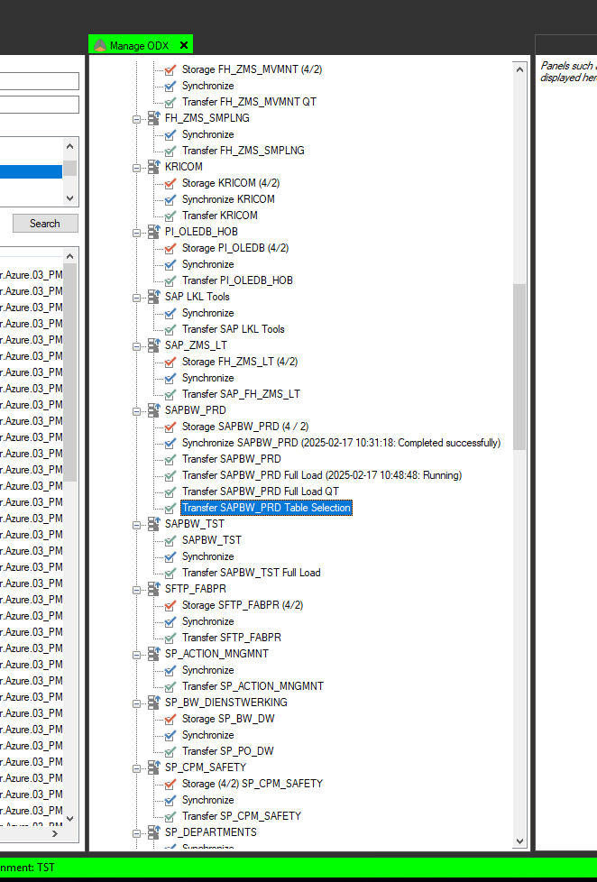
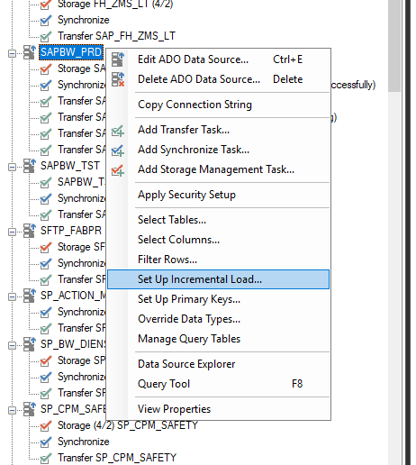
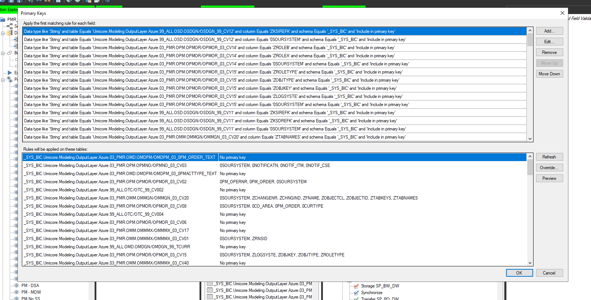
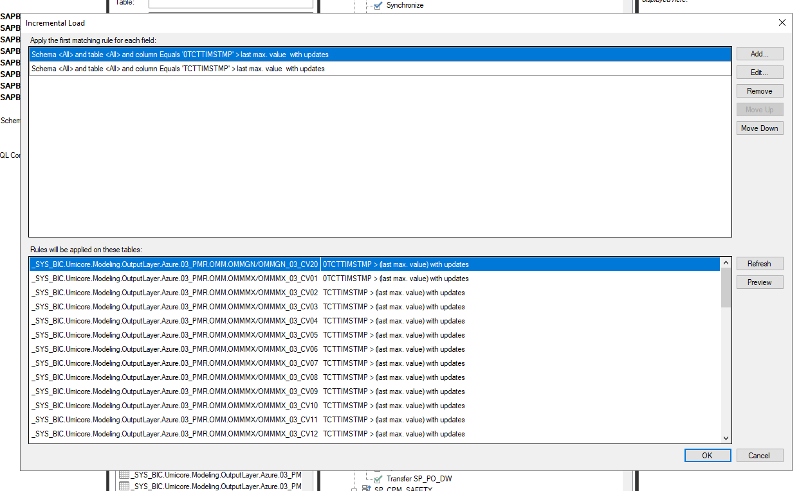
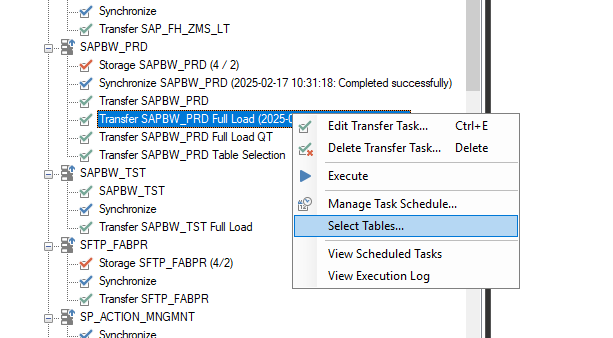
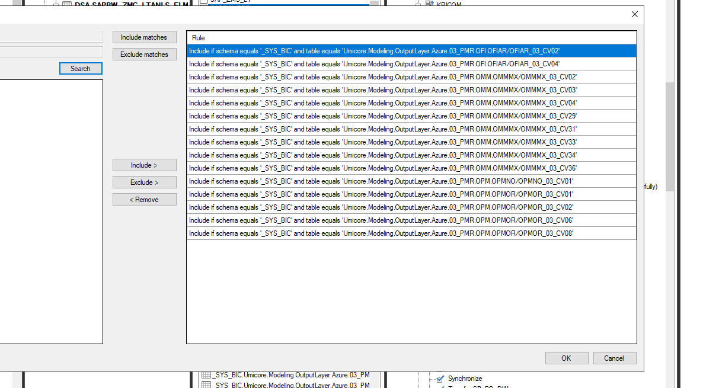

## implement incremental load

via manage ODX
- via incremental load setup 
- via primary key set up





primary key configuration:



incremental load configuration:



add tables in the selected tables for the activities





## sap zms lt migration

old ZMS_LT code

```DSA_ETL.VW_MX_ZMS_LT_FULL
SELECT [MANDT], [WERKS], [LT_SID], [UNT_CD], [NTT_WGHT], [FLG_END_PRDCTN], [CRTN_DT], [CRTN_TM], [CRTN_USR], [LM_DT], [LM_TM], [LM_USR], [LT_NMBR], [CTGR], [DSCRPTN], [PRDCT_CD], [CMMRCL_INDX_CD], [INVNTR_CD], [DPRTMNT_CD], [DSPTCH_CD], [PHSCL_ASPCT], [PHSCL_CD], [STTS_INVNTR], [INVNTR_PRD], [FLG_END_RCPTN], [DT_END_RCPTN], [DT_END_PRDCTN], [PVI_CD], [CRRCTNFCTRS_APPL], [CP_EXTRNL_EL], [FLG_OWN_MTRL], [FLG_EXCL_MTLFLW], [FLLW_UP_CD], [INHRTNC_TP_LT], [RFRNC_LT], [MTLFLW], [WGHT_UNT], [DMP_DNST], [LT_STTS], [LT_ANLS_FS], [WGHT_STTS_CD], [WSTD_WGHT], [CLSSFCTN_CD], [OXYD_CD], [CMMNT_SFTY], [CMMNT_ANL], [CMMNT], [PCKGNG], [ALLCTN], [DT_INIT_STCK], [DT_END_STCK], [LB_CLC_MTHD], [FS_6_CHCK], [FS_6_CHCK_DT], [FS_6_CHCK_USR], [FS_6_CMMNT], [FS_7_CHCK], [FS_7_CHCK_DT], [FS_7_CHCK_USR], [FS_7_CMMNT], [LT_TP], [ASS_TP], [H2O_TP], [CMMNT_PCKGNG], [CMMNT_DSTNTN], [SLT_NMBR], [DT_CONS_STCK], [FS_CHCK_INDCTR], [FLG_RISK_LOT], [LT_WSR_DT], [LB_ASS_DT], [FNL_ASS_DT], [PHSCL_ASPCT_FB], [TM_CONS_STCK], [PRD_BLCKNG_FLG], [DBLCKNG_DT], [RGB_CD], [RSKLT_CD], [LM_DTTM], [Batchfile], [DW_SourceCode], [DW_TimeStamp]
FROM [DSA_ETL].[VW_MX_ZMS_LT_FULL]
```


migrated to the following:

(note: we did not get rid of how the old view was built in case we need to rollback)

```
CREATE VIEW [DSA_ETL].[VW_MX_ZMS_LT_FULL]
AS

with old_api_zms_lt as (
select
	[MANDT],
	[WERKS],
	[LT_SID],
	[UNT_CD],
	[NTT_WGHT],
	[FLG_END_PRDCTN],
	[CRTN_DT],
	[CRTN_TM],
	[CRTN_USR],
	[LM_DT],
	[LM_TM],
	[LM_USR],
	[LT_NMBR],
	[CTGR],
	[DSCRPTN],
	[PRDCT_CD],
	[CMMRCL_INDX_CD],
	[INVNTR_CD],
	[DPRTMNT_CD],
	[DSPTCH_CD],
	[PHSCL_ASPCT],
	[PHSCL_CD],
	[STTS_INVNTR],
	[INVNTR_PRD],
	[FLG_END_RCPTN],
	[DT_END_RCPTN],
	[DT_END_PRDCTN],
	[PVI_CD],
	[CRRCTNFCTRS_APPL],
	[CP_EXTRNL_EL],
	[FLG_OWN_MTRL],
	[FLG_EXCL_MTLFLW],
	[FLLW_UP_CD],
	[INHRTNC_TP_LT],
	[RFRNC_LT],
	[MTLFLW],
	[WGHT_UNT],
	[DMP_DNST],
	[LT_STTS],
	[LT_ANLS_FS],
	[WGHT_STTS_CD],
	[WSTD_WGHT],
	[CLSSFCTN_CD],
	[OXYD_CD],
	[CMMNT_SFTY],
	[CMMNT_ANL],
	[CMMNT],
	[PCKGNG],
	[ALLCTN],
	[DT_INIT_STCK],
	[DT_END_STCK],
	[LB_CLC_MTHD],
	[FS_6_CHCK],
	[FS_6_CHCK_DT],
	[FS_6_CHCK_USR],
	[FS_6_CMMNT],
	[FS_7_CHCK],
	[FS_7_CHCK_DT],
	[FS_7_CHCK_USR],
	[FS_7_CMMNT],
	[LT_TP],
	[ASS_TP],
	[H2O_TP],
	[CMMNT_PCKGNG],
	[CMMNT_DSTNTN],
	[SLT_NMBR],
	[DT_CONS_STCK],
	[FS_CHCK_INDCTR],
	[FLG_RISK_LOT],
	[LT_WSR_DT],
	[LB_ASS_DT],
	[FNL_ASS_DT],
	[PHSCL_ASPCT_FB],
	[TM_CONS_STCK],
	[PRD_BLCKNG_FLG],
	[DBLCKNG_DT],
	[RGB_CD],
	[RSKLT_CD],
	[LM_DTTM],
	[BATCHFILE],
	[DW_SOURCECODE],
	[DW_TIMESTAMP]
FROM MX_FILES_LZ.ZMS_LT_FULL
), sapbw_zms_lt as (
select
	-- [MANDT],

/*
MANDT does not exist in SAPBW source
extra info:
It (MANDT) represents the client of the UMP system, which wil always be 099
Only in some systems like our development system we use different clients
099 is the normal system present everywhere, and 100 is used in UMD by the developers
*/

	[WERKS],
	[LT_SID],
	[UNT_CD],
	[NTT_WGHT],
	[FLG_END_PRDCTN],
	[CRTN_DT],
	[CRTN_TM],
	[CRTN_USR],
	[LM_DT],
	[LM_TM],
	[LM_USR],
	[LT_NMBR],
	[CTGR],
	[DSCRPTN],
	[PRDCT_CD],
	[CMMRCL_INDX_CD],
	[INVNTR_CD],
	[DPRTMNT_CD],
	[DSPTCH_CD],
	[PHSCL_ASPCT],
	[PHSCL_CD],
	[STTS_INVNTR],
	[INVNTR_PRD],
	[FLG_END_RCPTN],
	[DT_END_RCPTN],
	[DT_END_PRDCTN],
	[PVI_CD],
	[CRRCTNFCTRS_APPL],
	[CP_EXTRNL_EL],
	[FLG_OWN_MTRL],
	[FLG_EXCL_MTLFLW],
	[FLLW_UP_CD],
	[INHRTNC_TP_LT],
	[RFRNC_LT],
	[MTLFLW],
	[WGHT_UNT],
	[DMP_DNST],
	[LT_STTS],
	[LT_ANLS_FS],
	[WGHT_STTS_CD],
	[WSTD_WGHT],
	[CLSSFCTN_CD],
	[OXYD_CD],
	[CMMNT_SFTY],
	[CMMNT_ANL],
	[CMMNT],
	[PCKGNG],
	[ALLCTN],
	[DT_INIT_STCK],
	[DT_END_STCK],
	[LB_CLC_MTHD],
	[FS_6_CHCK],
	[FS_6_CHCK_DT],
	[FS_6_CHCK_USR],
	[FS_6_CMMNT],
	[FS_7_CHCK],
	[FS_7_CHCK_DT],
	[FS_7_CHCK_USR],
	[FS_7_CMMNT],
	[LT_TP],
	[ASS_TP],
	[H2O_TP],
	[CMMNT_PCKGNG],
	[CMMNT_DSTNTN],
	[SLT_NMBR],
	[DT_CONS_STCK],
	[FS_CHCK_INDCTR],
	[FLG_RISK_LOT],
	[LT_WSR_DT],
	[LB_ASS_DT],
	[FNL_ASS_DT],
	[PHSCL_ASPCT_FB],
	[TM_CONS_STCK],
	[PRD_BLCKNG_FLG],
	[DBLCKNG_DT],
	[RGB_CD],
	[RSKLT_CD],
	-- [LM_DTTM], -- not in sapbw
	-- [BATCHFILE], -- not in sapbw
	[DW_SOURCECODE],
	[DW_TIMESTAMP]
FROM [SAPBW_ZMS_LT]
) select * from sapbw_zms_lt
```


## sap ZMS_MVMNT migration

same/similar steps followed

### Impacted objects

Used DSA.SAPBW_ZMS_MVMNT as the source for DSA.VW_ZMS_MVMNT_FULL
	- DSA_ETL.VW_MX_ZMS_MVMNT_FULL can be decommissioned it seems
  	- acts as the latest extract and performs a union operation into DSA.VW_ZMS_MVMNT_FULL to update it