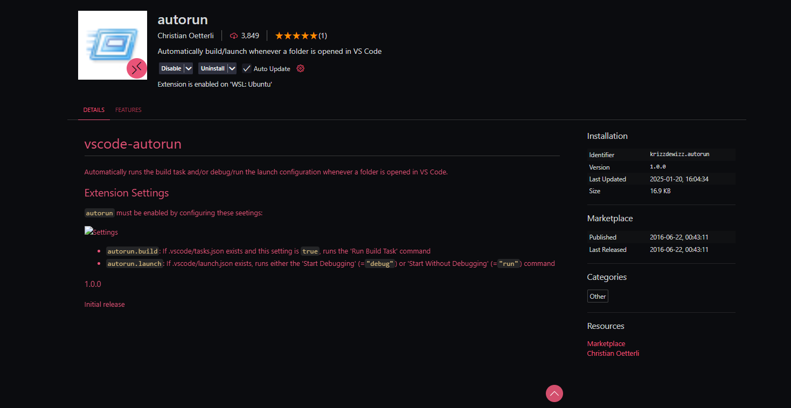
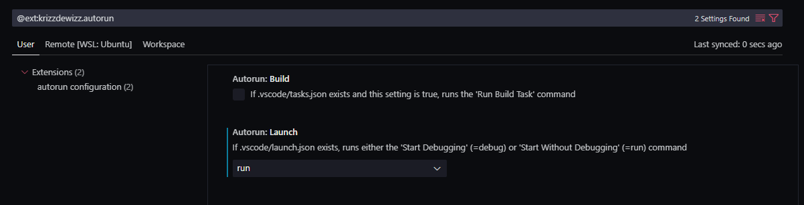

# JL's Personal

## Greetings Traveller

---

*Welcome, friend*

Hi! 

If you found this--welcome to my personal page. There is no real purpose to it. Just a bunch of things I find interesting / would like to keep track of. Here you can find my notes, thoughts, and projects all in one place. It's nothing polished nor commercial--just something I made for myself.

Here's what you'll probably stumble upon:

**Consultant Library:** 

Stuff I've figured out (or still struggle with) as a dude in tech. Expect some SQL, some Python, maybe some low-level programming, and likely the occasional rant about tools I'm wrestling with.

**Personal Projects:** 

Things I'm experimenting with--whether it's learning music theory, tinkering with emulators, or trying to make sense of my chaotic hobbies.

**Life and Reflections:** 

Random thoughts on life, inspired by books I've read, conversations I've had, or just a late-night rabbit hole of overthinking.

--

This place isn't really tailored for the public. 
It's more like a notebook I don't mind leaving open, 
in case you want to see what's going on in my head. 
If something here clicks with you--or even makes you laugh--then I'm happy.

Thanks for stopping by. Feel free to [message me](mailto:joseluisreyes43@gmail.com) if you've got thoughts or just want to catch up.

Take care,
JL

---

## Technical

### Set Up This Website

For full documentation visit [mkdocs.org](https://www.mkdocs.org).

#### Commands

* `mkdocs serve` - Start the live-reloading docs server.
* `mkdocs build` - Build the documentation site.
* `mkdocs -h` - Print help message and exit.

#### Run automatically on WSL Windows

1. Create `startup_personal_docs.bat`
   
```
@echo off
REM Activate WSL environment
wsl -d Ubuntu -e bash -c "cd ~/Documents/personal && source venv/bin/activate && mkdocs serve &"

REM Wait to ensure the server is up
timeout /t 5 > nul

REM Open Google Chrome to the local docs site
start chrome http://127.0.0.1:8000

REM Open VSCode in the personal directory
code "\\wsl.localhost\Ubuntu\home\jl43\Documents"

exit
```

2. Add the Script to Windows Startup
   - Press Win + R, type shell:startup, and press Enter.
   - Copy the startup_personal_docs.bat file into the opened folder. This will ensure it runs every time you log in.

3. Configure WSL and Python Virtual Environment
   - Ensure WSL is properly configured with your environment variables:
     - Ensure the virtual environment is in the correct directory and accessible via WSL.
     - Modify the batch script above if your venv activation path differs.
4. Depends on:  
- .vscode/launch.json
  (create if not exists)
   ```
   {
   "version": "0.2.0",
   "configurations": [
         {
            "name": "Run mkdocs server",
            "type": "node",
            "request": "launch",
            "program": "${workspaceFolder}",
            "preLaunchTask": "Run mkdocs server"
         }
   ]
   }
   ```
- .vscode/tasks.json
  (create if not exists)
   ```
   {
   "version": "2.0.0",
   "tasks": [
         {
            "label": "Run mkdocs server",
            "type": "shell",
            "command": "bash -c 'source venv/bin/activate && mkdocs serve'",
            "options": {
               "cwd": "${workspaceFolder}"
            },
            "problemMatcher": [],
            "presentation": {
               "echo": true,
               "reveal": "always",
               "focus": false,
               "panel": "shared"
            }
         }
   ]
   }
   ```