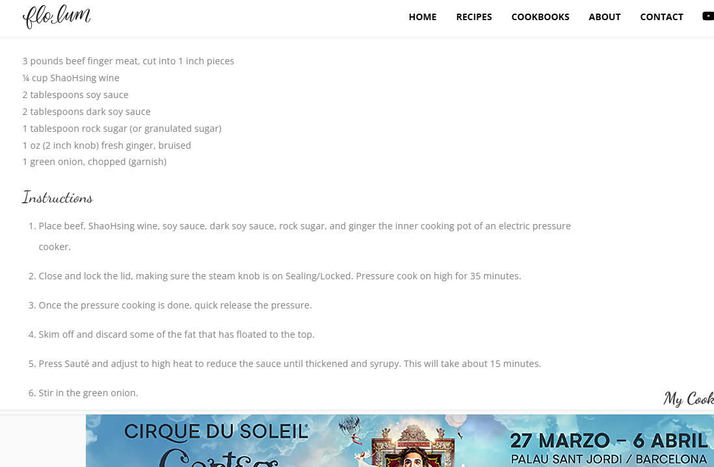
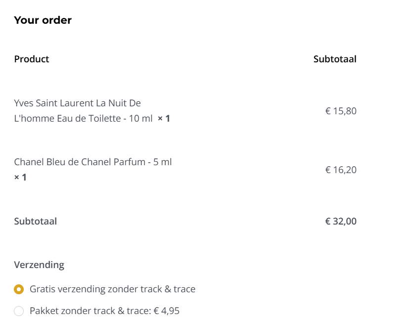

# To Organize

## Images

## Links
- [X: Smoked Butter!](https://x.com/houseofthemuse_/status/1806751874869321927?s=46&t=MdcvRemepk9iORSI7gN0Pw)
- [X: The besto pesto chicken bake I've seen in a hot minute.](https://x.com/southdallasfood/status/1806077260715466778?s=46&t=MdcvRemepk9iORSI7gN0Pw)
- [Crafting Interpreters](https://craftinginterpreters.com/introduction.html?im-WMpannNK=3688284798460048776)
- [LLVM Creating your own language](https://llvm.org/docs/tutorial/)
- [Reddit: I Made a Free AI-Powered Chord Progression Copilot](https://www.reddit.com/r/Learnmusic/comments/1b435ro/i_made_a_free_aipowered_chord_progression_copilot/?rdt=50053)
- [Sherlock: Search users across different sites](https://github.com/sherlock-project/sherlock)
- [Docling: parses documents and exports them to the desired format with ease and speed.](https://github.com/DS4SD/docling)
- [Glance: A self-hosted dashboard that puts all your feeds in one place](https://github.com/glanceapp/glance)
- [Azure DevOps Free Labs (12 months)](https://www.azuredevopslabs.com/)
- [Resume builder](https://github.com/AmruthPillai/Reactive-Resume)
- [Build your own "..."](https://github.com/codecrafters-io/build-your-own-x)
- [Really good parka "Karakoram"](https://en.frizm.co.kr/product/karakoram-down-parka-005-orange/3768/category/24/display/1/)
- [Great pull tab wallet](https://bellroy.com/products/card-sleeve-wallet?color=hazelnut&material=leather&size=default#slide-5)
- [Erik Darling: How To Write SQL Server Queries Correctly](https://www.youtube.com/playlist?list=PLt4QZ-7lfQicw3rvSrJKr7lwiwDRvZ_kN)
- [SQL Practice](https://datalemur.com/)
- [Stupidly good postman bag](https://www.bleu-de-chauffe.com/en/men/689-postman-bag-eclair-m-cuba-libre-3700716008020.html)
- [Crispy Chow Mein with Black Pepper Beef](https://flolum.com/crispy-chow-mein-with-black-pepper-beef/)
- [Poor man's LLM](https://www.reddit.com/r/LocalLLaMA/comments/1hpg2e6/budget_aka_poor_man_local_llm/)
- [Make your own soda (ginger bug)](https://www.youtube.com/shorts/hJxmLto0pZQ)
- [Fragrances: Getting Started](https://www.reddit.com/r/fragrance/comments/58ugki/how_to_start_complete_beginner/)
  - YSL La Nuit de L'Homme for evening / dinner wear
  - Blue de chanel for casual
  - 
- [How to run LLMs locally in 1 minute](https://x.com/dylan_ebert_/status/1876364896264474750?t=SNTjz9hryv_WxpTpe9JUow&s=19)
- [Interactive code examples in your site 1](https://github.com/nalgeon/codapi-js/blob/main/docs/html.md)
- [Interactive code examples in your site 2](https://codapi.org/)
- [Fiverr: Improve your resume](https://pro.fiverr.com/alexlouiserose/revise-your-engineering-resume-using-my-experience-as-a-tech-recruiter?utm_source=377295&utm_medium=cx_affiliate&utm_campaign=_bus-y&afp=&cxd_token=377295_37458721&show_join=true&ref_ctx_id=00f3bffbf13049a3802c2d3e95f5e97a&pckg_id=1&fiverr_choice=true&source=business_seller_page)
- [Fusor: Open Source Fusion Research](https://fusor.net/)
- [Peruvin Chicken](https://www.youtube.com/watch?v=rhIHkDY8zDk)
- [Mouse: Pulsar X3 Ultralight Weight eSports Mouse Size 2 (Black, White) (PX3R21, PX3R22)](https://ecommerce.datablitz.com.ph/collections/pulsar-x3-ultralight-weight-esports-mouse/products/pulsar-x3-ultralight-weight-esports-mouse-size-2-white-px3r22)
- [MKDocs](https://github.com/squidfunk/mkdocs-material)
- [SiYuan is a privacy-first personal knowledge management system](https://github.com/siyuan-note/siyuan)

## Posts

### SQL Related Post from LinkedIn
1. [Back To The Basics With SQL: Understanding Hash, Merge, and Nested Joins](https://lnkd.in/gh93t-c4)
2. [How to analyze merchant homepages visually at scale with SQL by Richard Meng](https://lnkd.in/eEpXFgUJ)
3. [Intermediate SQL Tutorial with Alex Freberg](https://lnkd.in/ep26nmmQ)
4. [Behind the Scenes of SQL: Understanding SQL Query Execution](https://lnkd.in/ejeW6gut)
5. [Transpiling SQL 1: JSON Paths by George Sittas](https://lnkd.in/gDEtwaC6)

### Data Modelling Guide
1. [Data Modeling Where Theory Meets Reality - How Different Companies I Worked At Modeled Their Data](https://lnkd.in/ekZvqqfe)
2. [Data Modeling - Building Slowly Changing Dimensions (SCDs) - Day 2 Lab- with Zach Morris Wilson](https://lnkd.in/g7PAWd8M)
3. [The Challenges You Will Face When Data Modeling](https://lnkd.in/gd5CQrZs)
4. [Key Tenets of the Kimball Method by Joy Mundy](https://lnkd.in/eDW9nVmY)
5. [Data Modeling - Why Data Engineers Need To Understand It](https://lnkd.in/gCvpMYhP)
6. [Beginner's Guide to building data models with dbt by Jeffrey Richman](https://lnkd.in/gUditV98)
7. [There's No Free Lunch in Data Modeling by Joe Reis](https://lnkd.in/ezN5-Ep9)

### How to install waydroid on steamdeck
1. `git clone https://github.com/ryanrudolfoba/steamos-waydroid-installer`
2. `cd steamos-waydroid-installer`
3. `chmod +x steamos-waydroid-installer.sh`
4. `./steamos-waydroid-installer.sh`
