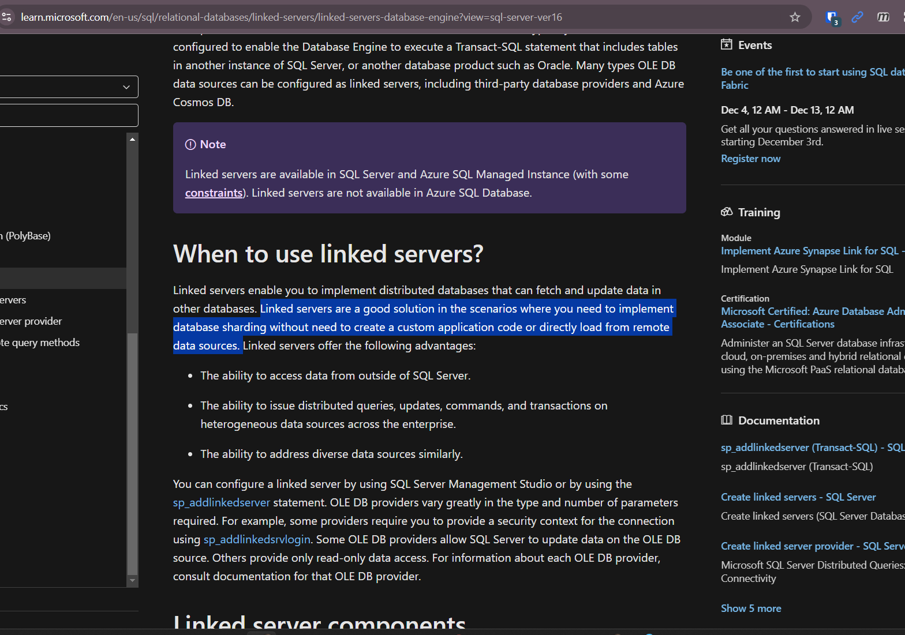

# 12092024

- Take a look at lead refinery snapshot and see if it can be implemented for plant maintenance
---
- Ine had mentioned that she would prefer the PI API way of working as she thinks the option to work with the linked server is not production-grade
  - Slightly disagree: 
  - No need for an application layer if we just do a database-to-database connection. 
  - Leverage database user security instead of managing API endpoint credentials and tokens
  - Point for API: was mentioned as the future "way-of-working"
    - This is from a data-access POV though and not really for lifting a large amount of historical data
- [link](https://learn.microsoft.com/en-us/sql/relational-databases/linked-servers/linked-servers-database-engine?view=sql-server-ver16)