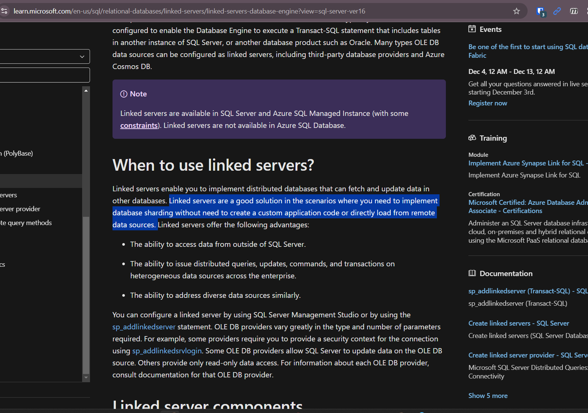

# 12092024

## Plant Maintenance Snapshots
- Take a look at lead refinery snapshot and see if it can be implemented for plant maintenance

## PI Web API VS SQL Linked Service
- Ine had mentioned that she would prefer the PI API way of working as she thinks the option to work with the linked server is not production-grade
  - Slightly disagree: 
  - `+` No need for an application layer if we just do a database-to-database connection. 
  - `+` Leverage database user security instead of managing API endpoint credentials and tokens
  - `-` Point for API: was mentioned as the future "way-of-working"
    - This is from a data-access POV though and not really for lifting a large amount of historical data
- [link](https://learn.microsoft.com/en-us/sql/relational-databases/linked-servers/linked-servers-database-engine?view=sql-server-ver16)
- Questions:
  - Any context we are blind to that has umicore enforcing PI Web API as the defacto way of communicating with PI?
  - Currently we are pulling from views created in PI SQL Commander Lite -> If we are to move to APIs for consistency, do we need to re-do?
  - Moving to an API way of working would enforce to be API devs over Data Engineers
    - Working with APIs VS working with Databases
- If we are to proceed with linked service, we need some backing to convince Jeroen De Wolf as well

## TimeXtender Stabilization
### Deploying and running priority reports in test to check for stability
- [x] - PI
- [x] - PI - DSA
- [x] - PI - MDW
- [x] - PM No SS
- [ ] - PM No SS - DSA
- [ ] - PM No SS - MDW
- [ ] - Safety
- [ ] - Safety - DSA
- [ ] - Safety - MDW
- [ ] - Lead Refinery
- [ ] - Lead Refinery - DSA
- [ ] - Lead Refinery - MDW

### Victor has validated the priority execution packages last Friday. 
- After 1 more week of stable runs & no reporting mishaps, recommend to delete old execution packages

### Reducing Load Times
- [TimeXtendter: Troubleshooting data cleansing rules](https://support.timextender.com/prepare-90/troubleshooting-data-cleansing-rules-883)