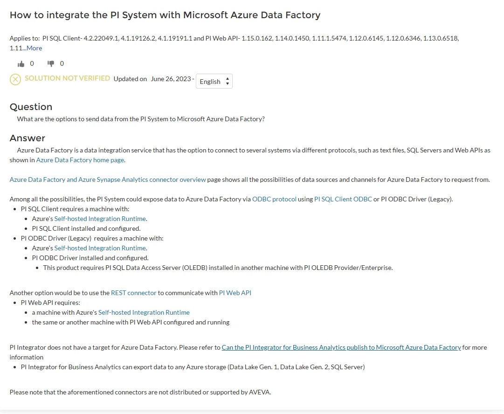
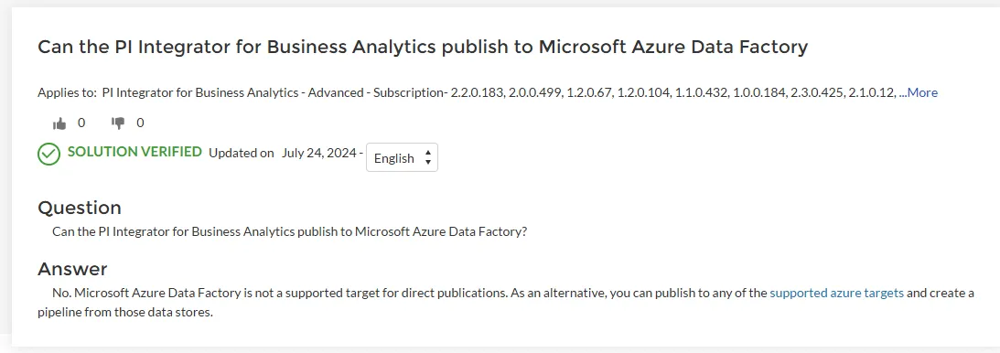
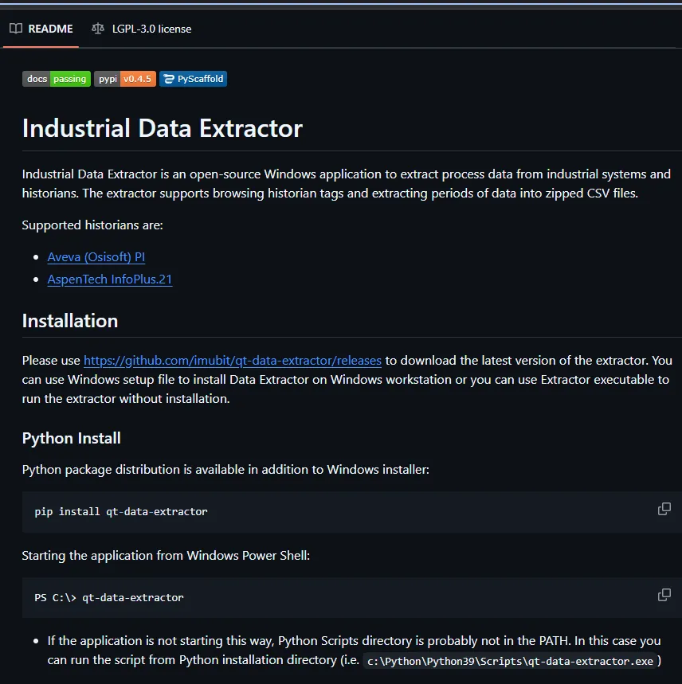

# Connection Options

## ADF via ODBC -> stage in adls
https://customers.osisoft.com/s/knowledgearticle?_ga=2.22463931.1004816514.1733924968-2016088800.1733924968&knowledgeArticleUrl=000039582

## ADF via OLEDB (same as what is used in Linked Server) -> stage in adls

## Linked Server -> stage in new DB in TX SQL Server

## PI Integrator
https://customers.osisoft.com/s/knowledgearticle?knowledgeArticleUrl=000032259
https://docs.aveva.com/bundle/pi-integrator-for-business-analytics/page/1023049.html

Constraint: 

## https://github.com/imubit/qt-data-extractor
