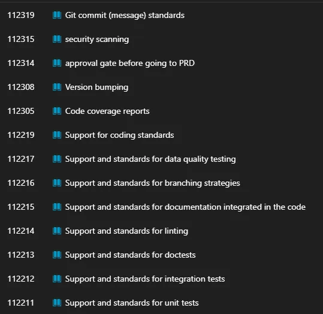
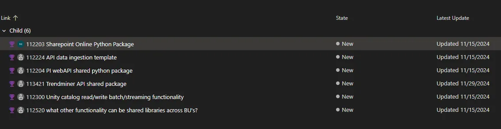

# Awkward Antelope Infra 2.0 Product Review

## Approach

- Imagine the daily tasks of a PMR Data Engineer, map it to features available in DevOps 
- **(User Experience > Product Features)**
  
### Imagine: as a Data Engineer in PMR, what is a typical day?

#### Platform Administration

- Check into the pipelines to see how they are doing
  - *Where?* 
    - Probably through the orchestrator in Databricks (confirm)
  - *Do we have access?* 
  - *Are we able to see all the pipelines that are meant for our user group? (and only our user group)*
  
- If there is something wrong with the pipelines, are we able to troubleshoot it?
  - View pipelines errors
  - Deepdive into pipeline errors
  - Inspect compiled code (read only in PRD)
    - Test/Troubleshoot compiled code in a development(?) environment
    - Allow pull of relevant source data to test code?
  - **[Relevant User Story?](https://dev.azure.com/umicore/DataAnalytics.IS.DSCoE/_workitems/edit/112238)**

#### Pipeline Development

##### Developer QOL

 - 1 log in, everything works
   - Test @ umicore and @ home
   - Allow running of code
     Python
     Allow pip installs (approved packages) in dev envs
     Git (test the commands, sometimes connection to remote repo is unreliable / affected by network restrictions)
 - SCD handling 
 - Metadata handling 
 - Docs on available utils / macros
 - Using and contributing to utils and macros
 - Code samples (showing umicore prescribed best practices)
   - SDP (for each layer within)
   - ADP (for each layer within)
 - Formatter (format on save)
   - Relevant: sqlfrmt

#### CI/CD

- Production Protection
- Guidelines for environments
  - What activities are allowed for Dev->Test->Prod?
  - **Relevant activities for guidelines:**
  - 

#### Stakeholder Reporting

- What tools are available for a PMR Data Engineer to share insights to a stakeholder?
  - ADHOC & Production sharing

## PMR Data Ingestion 

- Observations on Shared Libraries Development
  - Significant effort appears to be directed toward building Shared Libraries, primarily using Python, particularly in the area of Data Ingestion.
  - 
    - **Key Concern:** The PMR team's core skill set revolves around SQL rather than Python.
    - While it is understood that this is a shared domain with Data Scientists, representation and input from the Data Engineering team might be good.
    - Establishing a clear and consistent lingua franca for development within a domain (e.g., SQL or Python for DE domain) will have a lasting impact on future development efforts.
- It could be that our data integration focused more on python and API way of working because the Data Scientists needed data, and so they "hopped" over the Data Engineering group, with the fact that TX hadn't been reliable.
- From an operational standpoint though, Data Engineers should own the Data Integration processes, providing structured and reliable datasets for Data Scientists to build upon
  - **Key Consideration:** Are our Data Engineering practices mature enough to take full ownership of Data Integration?

