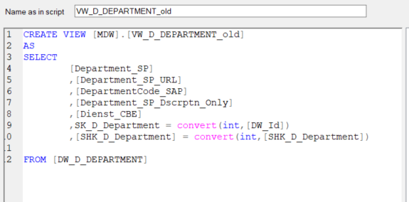

# SK_D_Department Investigation

## Details

### The New Department Dim
- Before December 2024, the PMR TimeXtender environment had been on multiple Department Dimension tables
  - Department_SP
    - `DSA.Department_SP` <-> `MDW.DW_D_Department` <-> `MDW.VW_D_Department` <-> `MDW.DW_D_Department_Hoboken`
    - The objects listed are equivalent to each other (all sourced from the DSA table)
    - **"old"** Department Dim
    - Joins seemingly happen on any one of these four depending on the fact table
  - Department_SPO
    - `DSA.Department_SPO`
    - New records coming from SharePoint Online that take priority over the records in Department_SP
  - Department_Mapping
    - `DSA.Department_Mapping`
    - Used by Safety
    - Manually created by extracting Department_SP & Department_SPO, creating an excel file, manually mapping values, and loading as the dim

- On December 2024, we got rid of `Department_Mapping` and created a new **department dimension** table
  - Properly combined Department_SP & Department_SPO with accompanying SCD2
    - Prioritizes records from Department_SPO 
    - If record exists on both tables, Department_SP record is listed as an inactive record (SCD2)
    - If no matching record, uses Department_SP record and flags as an active record
  - `MDW.VW_D_Department` from `DSA.Department_SP` was renamed to `MDW.VW_D_Department_old` as not to break any existing models using it
    - Migration away from this is ongoing as of `10/01/2025`
  - `MDW.VW_D_Department` represents the new department dimension
  - Designated a rule to **not** use any Department Tables in DSA
  - The team to use only **one** department dimension

- For clarity, we will refer to 
  - `Department_SP` and its downstream tables and views as `department old`
  - Merge of `Department_SP` and `Department_SPO` as `department new`

### SK_D_Department

- Upon the removal of `DSA.Department_Mapping`, we had begun the remapping of the fact tables in `Safety`
- It was from here that it was discovered that a large amount of fact tables are joining on `department old`.`SK_D_Department` (supposedly represents a surrogate key)
- Looking into SK_D_Department, it has the following logic
  - `SK_D_Department = convert(int,[DW_Id])`
- The above introduces several problems:
  - DW_Id is an incremental ID assigned by TimeXtender *(metadata)* and is not representative of any business logic
  - Upon checking and search for the more appropriate `department_id` in `department old`, we find that it does not exist
  - 

### Resolution

- We will be remapping the numerous joins occuring on `SK_D_Department` and properly join them on the `department_id` (`MDW.VW_D_Department.id` to be specific)
- This affects the following tables (& their corresponding views):
  - `MDW.DW_D_Internal`
  - `MDW.DW_F_Accident`
  - `MDW.DW_F_Audit_5S`
  - `MDW.DW_F_BW_DEVICES`
  - `MDW.DW_F_BW_INTERVENTIONS`
  - `MDW.DW_F_BW_MEASURES`
  - `MDW.DW_F_CBE`
  - `MDW.DW_F_FOLLOWUP_TASK`
  - `MDW.DW_F_FOLLOWUP_TASK_MONTHLY`
  - `MDW.DW_F_HAZOP`
  - `MDW.DW_F_INCIDENT`
  - `MDW.DW_F_MOC_ITEM`
  - `MDW.DW_F_NOTIFICATIONCENTER`
  - `MDW.DW_F_OBSERVATION_CPM`
  - `MDW.DW_F_SAFETY`
  - `MDW.DW_F_SICKNESS_CHECK`
  - `MDW.DW_F_SICKNESS_CONVERSATIONS`
  - `MDW.DW_F_SICKNESS_NOTIFICATION`
  - `MDW.DW_F_TAG_ACTIONS`
  - `MDW.DW_F_WOB_SP`
  - `MDW.DW_F_HWT_LIFTING_EQUIPMENT`
- The joins are currently occurring on the Tables (`MDW.DW_F...`) instead of the Views (`MDW.VW_F...`)
  - The join logic will also be migrated to those